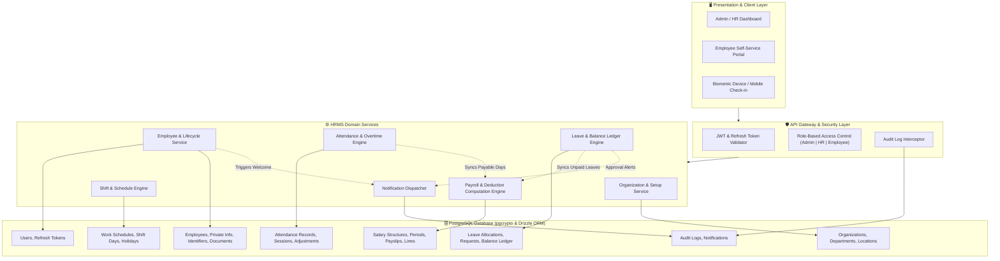
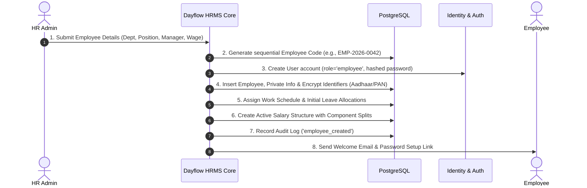
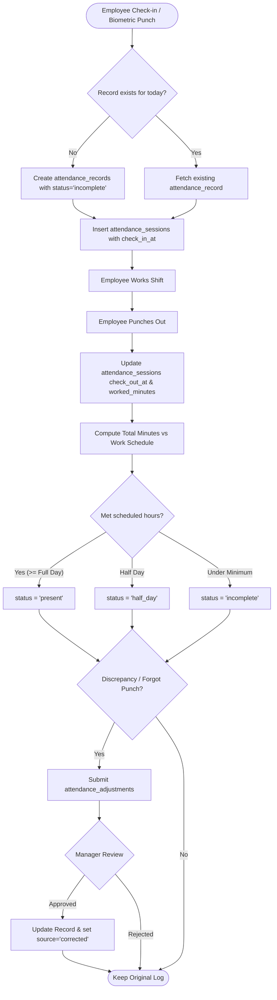
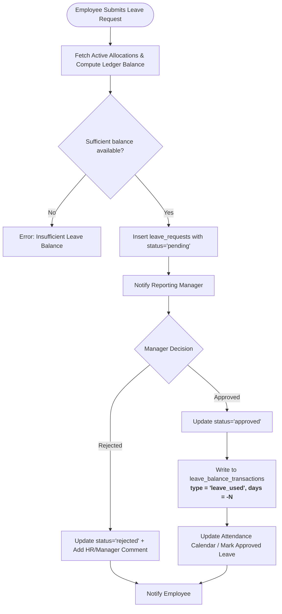

# Dayflow HRMS — Architecture, ER Diagrams & Flow Documentation

This document provides a comprehensive technical overview of the **Dayflow Human Resource Management System (HRMS)** database architecture, entity relationships, and core business workflow diagrams.

---

## Table of Contents

1. [System Architecture Overview](#1-system-architecture-overview)
2. [Entity-Relationship (ER) Diagram](#2-entity-relationship-er-diagram)
3. [Module Breakdown & Responsibilities](#3-module-breakdown--responsibilities)
4. [Business Workflows & Flowcharts](#4-business-workflows--flowcharts)
   - [Flow 1: Employee Onboarding & Lifecycle](#flow-1-employee-onboarding--lifecycle)
   - [Flow 2: Attendance Tracking & Regularization](#flow-2-attendance-tracking--regularization)
   - [Flow 3: Leave Management & Balance Ledger](#flow-3-leave-management--balance-ledger)
   - [Flow 4: Monthly Payroll Processing Cycle](#flow-4-monthly-payroll-processing-cycle)
5. [Database Design & Integrity Constraints](#5-database-design--integrity-constraints)

---

## 1. System Architecture Overview

The application follows a multi-tier layered architecture separating presentation, security/routing, domain business logic, and transactional persistence.



---

## 2. Entity-Relationship (ER) Diagram

The following ER diagram maps all 9 modules across 24 relational tables.

```mermaid
erDiagram
    %% ── MODULE 01: ORGANIZATION ──
    organizations ||--o{ departments : "has"
    organizations ||--o{ job_positions : "has"
    organizations ||--o{ locations : "has"
    organizations ||--o{ holidays : "defines"
    organizations ||--o{ work_schedules : "defines"
    organizations ||--o{ leave_types : "defines"
    organizations ||--o{ salary_component_definitions : "defines"
    organizations ||--|| payroll_settings : "configures"

    %% ── MODULE 02: IDENTITY ──
    organizations ||--o{ users : "has"
    users ||--o{ refresh_tokens : "has"

    %% ── MODULE 03: EMPLOYEE ──
    organizations ||--o{ employees : "employs"
    users ||--o| employees : "assigned_to"
    departments ||--o{ employees : "in"
    departments ||--o| employees : "managed_by"
    job_positions ||--o{ employees : "holds"
    locations ||--o{ employees : "stationed_at"
    employees ||--o{ employees : "reports_to"

    employees ||--|| employee_private_info : "has"
    employees ||--o{ employee_bank_accounts : "has"
    employees ||--|| employee_identifiers : "has"
    employees ||--o{ employee_documents : "owns"
    employees ||--o{ certifications : "holds"
    organizations ||--o{ employee_code_sequences : "tracks"

    organizations ||--o{ skills : "catalogues"
    employees ||--o{ employee_skills : "has"
    skills ||--o{ employee_skills : "categorized_in"

    %% ── MODULE 04: WORK MANAGEMENT ──
    work_schedules ||--o{ work_schedule_days : "defines"
    employees ||--o{ employee_schedule_assignments : "assigned"
    work_schedules ||--o{ employee_schedule_assignments : "applies_to"

    %% ── MODULE 05: ATTENDANCE ──
    employees ||--o{ attendance_records : "logs"
    attendance_records ||--o{ attendance_sessions : "contains"
    attendance_records ||--o{ attendance_adjustments : "corrected_by"
    users ||--o{ attendance_adjustments : "requests"
    users ||--o{ attendance_adjustments : "approves"

    %% ── MODULE 06: LEAVE ──
    employees ||--o{ leave_allocations : "receives"
    leave_types ||--o{ leave_allocations : "typed_as"
    employees ||--o{ leave_requests : "submits"
    leave_types ||--o{ leave_requests : "typed_as"
    employees ||--o{ leave_balance_transactions : "ledgers"
    leave_types ||--o{ leave_balance_transactions : "ledgers"

    %% ── MODULE 07: PAYROLL ──
    employees ||--o{ salary_structures : "has"
    salary_structures ||--o{ salary_structure_components : "composed_of"
    salary_component_definitions ||--o{ salary_structure_components : "defines"

    organizations ||--o{ payroll_periods : "executes"
    payroll_periods ||--o{ payslips : "includes"
    employees ||--o{ payslips : "receives"
    salary_structures ||--o{ payslips : "based_on"
    payslips ||--o{ payslip_lines : "itemized_in"
    payslips ||--|| payslip_attendance_summary : "summarizes"

    %% ── MODULE 08: NOTIFICATIONS & AUDIT ──
    users ||--o{ notifications : "receives"
    organizations ||--o{ audit_logs : "records"
    users ||--o{ audit_logs : "performed_by"

    %% ==================================================================
    %% ENTITY ATTRIBUTES
    %% ==================================================================

    organizations {
        uuid id PK
        varchar name
        varchar code UK
        text logo_url
        varchar email
        varchar phone
        text address
        varchar city
        varchar state
        varchar country
        varchar timezone
        varchar currency
        boolean is_active
    }

    users {
        uuid id PK
        uuid organization_id FK
        varchar first_name
        varchar last_name
        varchar email UK
        varchar password
        text profile_image
        user_role role
        boolean email_verified
        boolean is_active
        boolean is_deleted
        timestamptz last_login_at
        boolean must_change_password
        int failed_login_attempts
    }

    refresh_tokens {
        uuid id PK
        uuid user_id FK
        varchar token_hash
        timestamptz expires_at
        timestamptz revoked_at
    }

    employees {
        uuid id PK
        uuid organization_id FK
        uuid user_id FK
        varchar employee_code UK
        varchar first_name
        varchar last_name
        varchar display_name
        date date_of_birth
        gender_type gender
        uuid department_id FK
        uuid job_position_id FK
        uuid manager_id FK
        uuid location_id FK
        date joining_date
        date termination_date
        employment_status status
        employment_type type
    }

    departments {
        uuid id PK
        uuid organization_id FK
        varchar name
        varchar code
        uuid manager_employee_id FK
        boolean is_active
    }

    job_positions {
        uuid id PK
        uuid organization_id FK
        varchar name
        text description
        boolean is_active
    }

    locations {
        uuid id PK
        uuid organization_id FK
        varchar name
        text address
        boolean is_active
    }

    employee_private_info {
        uuid employee_id PK
        text residential_address
        varchar personal_email
        varchar nationality
        marital_status_type marital_status
        varchar emergency_contact_name
        varchar emergency_contact_phone
    }

    employee_bank_accounts {
        uuid id PK
        uuid employee_id FK
        varchar account_holder_name
        bytea account_number_encrypted
        varchar bank_name
        varchar ifsc_code
        boolean is_primary
    }

    employee_identifiers {
        uuid employee_id PK
        bytea pan_encrypted
        bytea uan_encrypted
        bytea aadhaar_encrypted
    }

    employee_documents {
        uuid id PK
        uuid employee_id FK
        document_type document_type
        varchar file_name
        text file_url
        varchar mime_type
        bigint file_size
        uuid uploaded_by FK
    }

    work_schedules {
        uuid id PK
        uuid organization_id FK
        varchar name
        varchar timezone
        boolean is_active
        int default_break_minutes
    }

    work_schedule_days {
        uuid id PK
        uuid schedule_id FK
        int weekday
        boolean is_working_day
        time start_time
        time end_time
        int break_minutes
    }

    employee_schedule_assignments {
        uuid id PK
        uuid employee_id FK
        uuid schedule_id FK
        date effective_from
        date effective_to
    }

    holidays {
        uuid id PK
        uuid organization_id FK
        varchar name
        date holiday_date
        boolean is_optional
    }

    attendance_records {
        uuid id PK
        uuid employee_id FK
        date attendance_date
        attendance_status status
        int total_work_minutes
        int scheduled_work_minutes
        int overtime_minutes
        int late_minutes
        attendance_source source
    }

    attendance_sessions {
        uuid id PK
        uuid attendance_record_id FK
        timestamptz check_in_at
        timestamptz check_out_at
        int worked_minutes
        int break_minutes
    }

    attendance_adjustments {
        uuid id PK
        uuid attendance_record_id FK
        uuid requested_by FK
        uuid approved_by FK
        jsonb old_value
        jsonb new_value
        adjustment_status status
    }

    leave_types {
        uuid id PK
        uuid organization_id FK
        varchar code
        varchar name
        boolean is_paid
        boolean requires_allocation
        boolean requires_approval
        leave_unit unit
    }

    leave_allocations {
        uuid id PK
        uuid employee_id FK
        uuid leave_type_id FK
        date period_start
        date period_end
        numeric allocated_days
        numeric carried_forward_days
        uuid created_by FK
    }

    leave_requests {
        uuid id PK
        uuid employee_id FK
        uuid leave_type_id FK
        date start_date
        date end_date
        leave_half start_half
        leave_half end_half
        numeric requested_days
        leave_status status
        uuid approved_by FK
    }

    leave_balance_transactions {
        uuid id PK
        uuid employee_id FK
        uuid leave_type_id FK
        leave_transaction_type transaction_type
        numeric days
        varchar reference_type
        uuid reference_id
    }

    payroll_settings {
        uuid id PK
        uuid organization_id FK
        varchar payroll_frequency
        varchar payroll_currency
        int pay_day
        numeric working_days_basis
        boolean pf_enabled
        boolean professional_tax_enabled
    }

    salary_component_definitions {
        uuid id PK
        uuid organization_id FK
        varchar code
        varchar name
        salary_component_type component_type
        salary_calculation_type calculation_type
        boolean is_active
    }

    salary_structures {
        uuid id PK
        uuid employee_id FK
        numeric monthly_wage
        wage_type wage_type
        date effective_from
        date effective_to
        varchar status
        uuid created_by FK
    }

    salary_structure_components {
        uuid id PK
        uuid salary_structure_id FK
        uuid component_definition_id FK
        salary_calculation_type calculation_type
        numeric percentage
        numeric fixed_amount
        boolean is_residual
    }

    payroll_periods {
        uuid id PK
        uuid organization_id FK
        date period_start
        date period_end
        payroll_period_status status
        timestamptz finalized_at
        uuid created_by FK
    }

    payslips {
        uuid id PK
        uuid payroll_period_id FK
        uuid employee_id FK
        uuid salary_structure_id FK
        numeric monthly_wage
        numeric payable_days
        numeric gross_earnings
        numeric total_employee_deductions
        numeric net_pay
        payslip_status status
    }

    payslip_lines {
        uuid id PK
        uuid payslip_id FK
        varchar component_code
        varchar component_name
        salary_component_type component_type
        numeric amount
    }

    payslip_attendance_summary {
        uuid payslip_id PK
        int total_calendar_days
        numeric scheduled_days
        numeric present_days
        numeric paid_leave_days
        numeric unpaid_leave_days
        numeric payable_days
        int overtime_minutes
    }

    notifications {
        uuid id PK
        uuid user_id FK
        notification_type type
        varchar title
        boolean is_read
    }

    audit_logs {
        uuid id PK
        uuid organization_id FK
        uuid actor_user_id FK
        varchar action
        varchar entity_type
        uuid entity_id
        jsonb old_data
        jsonb new_data
    }
```



---

## 3. Module Breakdown & Responsibilities

| Module                   | Core Tables                                                                                                                                                                          | Key Capabilities                                                                                                                                               |
| ------------------------ | ------------------------------------------------------------------------------------------------------------------------------------------------------------------------------------ | -------------------------------------------------------------------------------------------------------------------------------------------------------------- |
| **01. Organization**     | `organizations`, `departments`, `job_positions`, `locations`, `holidays`                                                                                                             | Multi-tenant tenant configuration, company structure, branch locations, and official holidays.                                                                 |
| **02. Identity & Auth**  | `users`, `refresh_tokens`                                                                                                                                                            | Authentication, password reset, login rate-limiting, and Role-Based Access Control (`admin`, `hr`, `employee`).                                                |
| **03. Employee Profile** | `employees`, `employee_private_info`, `employee_bank_accounts`, `employee_identifiers`, `employee_documents`, `skills`, `certifications`                                             | Master employee profile, encrypted PII (Aadhaar, PAN, Bank Accounts via `pgcrypto`), hierarchical reporting managers.                                          |
| **04. Work Management**  | `work_schedules`, `work_schedule_days`, `employee_schedule_assignments`                                                                                                              | Shift definitions, working hours per weekday, break durations, and historical shift assignments.                                                               |
| **05. Attendance**       | `attendance_records`, `attendance_sessions`, `attendance_adjustments`                                                                                                                | Daily attendance aggregation, multiple in/out punch sessions, late calculation, overtime, and manager regularization workflow.                                 |
| **06. Leave Management** | `leave_types`, `leave_allocations`, `leave_requests`, `leave_balance_transactions`                                                                                                   | Paid/unpaid leave categories, quota allocations, multi-day & half-day requests, approval flows, and an **immutable balance ledger**.                           |
| **07. Payroll Engine**   | `payroll_settings`, `salary_component_definitions`, `salary_structures`, `salary_structure_components`, `payroll_periods`, `payslips`, `payslip_lines`, `payslip_attendance_summary` | Salary components (Earnings, Deductions, Residuals), monthly payroll cycles, automated LOP deductions from attendance/leave summaries, and payslip generation. |
| **08. Notifications**    | `notifications`                                                                                                                                                                      | System alerts for leave status, payroll release, password changes, and punch reminders.                                                                        |
| **09. Audit Logging**    | `audit_logs`                                                                                                                                                                         | Immutable JSON audit trail capturing before/after state diffs on critical operations.                                                                          |

---

## 4. Business Workflows & Flowcharts

### Flow 1: Employee Onboarding & Lifecycle



---

### Flow 2: Attendance Tracking & Regularization



---

### Flow 3: Leave Management & Balance Ledger



---

### Flow 4: Monthly Payroll Processing Cycle

```mermaid
flowchart TD
    Init([HR Admin Initiates Payroll Period]) --> PeriodDraft[Create payroll_periods status='draft']
    PeriodDraft --> IterateEmps[For Each Active Employee]

    IterateEmps --> FetchSchedule[1. Fetch Work Schedule & Calendar Days]
    FetchSchedule --> FetchAttendance[2. Query Attendance Summary: Present, Absent, Half-days]
    FetchAttendance --> FetchLeaves[3. Query Leaves: Paid vs Unpaid LOP Days]
    FetchLeaves --> CalcPayable[4. Calculate Payable Days = Scheduled - (Absent + Unpaid Leaves)]

    CalcPayable --> FetchSalary[5. Resolve Active salary_structures]
    FetchSalary --> CompEarnings[6. Compute Earnings: Basic, HRA, Allowances]
    CompEarnings --> CompLOP[7. Apply Unpaid Leave Deductions: Gross * Unpaid / Base Days]
    CompLOP --> CompDeductions[8. Compute Deductions: PF, PT, Tax]
    CompDeductions --> CalcNet[9. Net Pay = Total Earnings - Total Deductions]

    CalcNet --> SavePayslip[10. Insert payslips + payslip_lines + payslip_attendance_summary]
    SavePayslip --> AllDone{All Employees Processed?}
    AllDone -- No --> IterateEmps
    AllDone -- Yes --> ReviewStatus[Update payroll_periods status='review']
    ReviewStatus --> HRApprove{HR Final Approval}
    HRApprove -- Approved --> Finalize[Set Period status='finalized' -> Dispatch Payslips]
    HRApprove -- Rejected / Adjust --> ManualTweak[Adjust Payslip Lines & Recalculate]
    ManualTweak --> ReviewStatus
```

---

## 5. Database Design & Integrity Constraints

1. **Multi-Tenancy**: All primary domain tables enforce foreign keys pointing to `organizations(id)` with cascading deletes.
2. **Double-Entry Leave Accounting**: Rather than storing a mutable `remaining_days` column, leave balances are calculated from immutable `leave_balance_transactions` records (`allocation`, `leave_used`, `leave_cancelled`, `carry_forward`).
3. **Encrypted PII**: Sensitive employee data (`pan_encrypted`, `aadhaar_encrypted`, `account_number_encrypted`) uses PostgreSQL `BYTEA` encrypted with AES-256 (`pgcrypto`).
4. **Audit Trail**: Every significant state change in the system captures an immutable row in `audit_logs` preserving previous and updated JSON snapshots (`old_data`, `new_data`).
