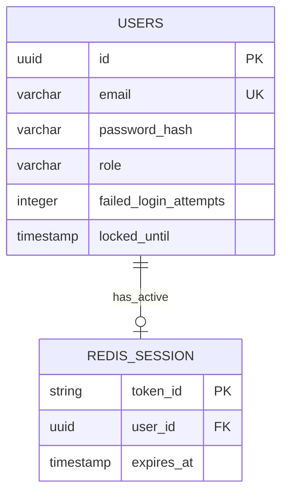
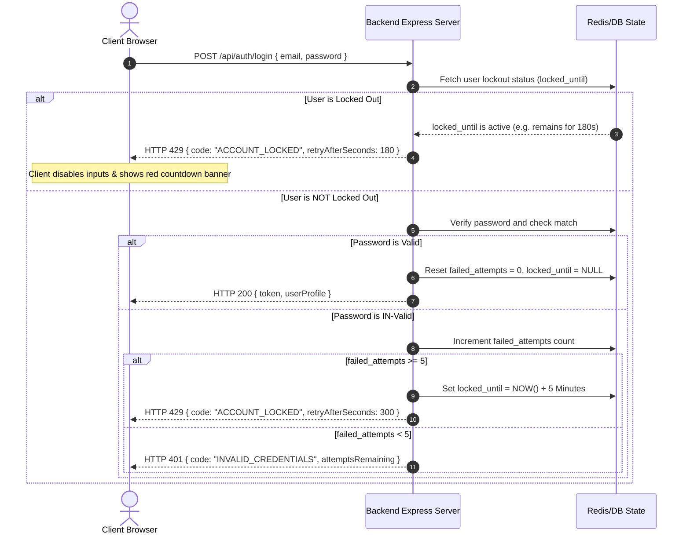

# useIt.md — Full-Stack Login Integration Guide

This guide describes how to connect and run the React login components inside a full-stack development environment, detailing client-side state hooks, API routing, database schema expectations, and security policies (such as brute-force lockout mitigation).

---

## 1. Client-Side Integration (React & Router)

### A. Component Import & Props Map

The root view coordinator [LoginForm.jsx](file:///d:/Hackathon-UI/UI/src/components/Login/LoginLayout/LoginForm/LoginForm.jsx) is integrated into your router views. It exposes navigation callbacks and success hooks:

```javascript
import LoginForm from '@/components/Login/LoginLayout/LoginForm/LoginForm';

function LoginView() {
    const handleLoginSuccess = () => {
        // 1. Fetch user profile context
        // 2. Redirect to landing dashboard view
    };

    return (
        <LoginForm
            onNavigateToForgot={() => navigate('/forgot-password')}
            onNavigateToRegister={() => navigate('/register')}
            onLoginSuccess={handleLoginSuccess}
        />
    );
}
```

### B. Global AuthContext Integration

Once the backend verifies the user credentials, store the session token (e.g., JWT) in a global React Context state and persist it in the browser storage:

```javascript
import React, { createContext, useContext, useState } from 'react';

const AuthContext = createContext(null);

export function AuthProvider({ children }) {
    const [user, setUser] = useState(null);
    const [token, setToken] = useState(localStorage.getItem('token') || '');

    const login = (userData, jwtToken) => {
        setUser(userData);
        setToken(jwtToken);
        localStorage.setItem('token', jwtToken);
    };

    const logout = () => {
        setUser(null);
        setToken('');
        localStorage.removeItem('token');
    };

    return (
        <AuthContext.Provider value={{ user, token, login, logout }}>
            {children}
        </AuthContext.Provider>
    );
}

export const useAuth = () => useContext(AuthContext);
```

---

## 2. API Integration Layer (Backend)

The form submits values to the backend via a POST request.

### A. Authentication Request

- **Endpoint**: `POST /api/auth/login`
- **Content-Type**: `application/json`
- **Request Payload**:

```json
{
    "role": "Team Manager",
    "email": "user@example.com",
    "password": "userPassword123"
}
```

### B. Successful Login Response

- **HTTP Status**: `200 OK`
- **Response Payload**:

```json
{
    "success": true,
    "token": "eyJhbGciOiJIUzI1NiIsInR5cCI6IkpXVCJ9...",
    "user": {
        "id": "usr_9281a021",
        "email": "user@example.com",
        "role": "Team Manager",
        "displayName": "Alex Mercer"
    }
}
```

### C. Failed Authentication (Invalid Credentials)

- **HTTP Status**: `401 Unauthorized`
- **Response Payload**:

```json
{
    "success": false,
    "code": "INVALID_CREDENTIALS",
    "message": "Invalid email address or password.",
    "attemptsRemaining": 3
}
```

### D. Account Locked Response (Too Many Failed Attempts)

- **HTTP Status**: `429 Too Many Requests`
- **Response Payload**:

```json
{
    "success": false,
    "code": "ACCOUNT_LOCKED",
    "message": "Account temporarily locked due to multiple failed login attempts.",
    "retryAfterSeconds": 300
}
```

---

## 3. Database & Caching Schema Requirements

To support secure authorization and brute-force protection, your database and cache engines must support the following structure:



### A. SQL User Schema Definition (Example PostgreSQL)

```sql
CREATE TABLE users (
    id UUID PRIMARY KEY DEFAULT gen_random_uuid(),
    email VARCHAR(255) UNIQUE NOT NULL,
    password_hash VARCHAR(255) NOT NULL,
    role VARCHAR(50) NOT NULL CHECK (role IN ('Workspace Member', 'Team Manager', 'Administrator')),
    failed_login_attempts INT DEFAULT 0,
    locked_until TIMESTAMP NULL,
    created_at TIMESTAMP DEFAULT CURRENT_TIMESTAMP
);
```

### B. Redis Configuration for Brute-Force Rate Limiting (Optional Cache Layer)

Using Redis reduces SQL write load when tracking active lockout attempts.

- **Redis Key Structure**: `lockout:attempts:<email>`
- **Expiry**: Set TTL to `300 seconds` (5 minutes) upon reaching the failure threshold.

---

## 4. Full-Stack Account Lockout Lifecycle

The system utilizes a client-server sync workflow to enforce lockouts:



### Backend Middleware Logic (Express.js Example)

Implement this authentication handler on your server middleware pipeline to link attempts:

```javascript
const bcrypt = require('bcrypt');
const db = require('./db'); // Database pool wrapper

async function loginController(req, res) {
    const { email, password, role } = req.body;
    const maxAttempts = 5;
    const lockoutTimeSeconds = 300; // 5 Minutes

    try {
        // 1. Fetch user record from database
        const user = await db.query('SELECT * FROM users WHERE email = $1', [email]);
        if (!user) {
            return res
                .status(401)
                .json({ code: 'INVALID_CREDENTIALS', message: 'Invalid credentials.' });
        }

        // 2. Check if user is currently locked out
        if (user.locked_until && new Date(user.locked_until) > new Date()) {
            const remainingSeconds = Math.round((new Date(user.locked_until) - new Date()) / 1000);
            return res.status(429).json({
                code: 'ACCOUNT_LOCKED',
                message: 'Account locked.',
                retryAfterSeconds: remainingSeconds,
            });
        }

        // 3. Compare passwords
        const passwordMatch = await bcrypt.compare(password, user.password_hash);
        if (passwordMatch) {
            // Success: Reset failure count and unlock account
            await db.query(
                'UPDATE users SET failed_login_attempts = 0, locked_until = NULL WHERE id = $1',
                [user.id],
            );

            const token = generateJwtToken(user);
            return res.status(200).json({
                success: true,
                token,
                user: { id: user.id, email: user.email, role: user.role },
            });
        } else {
            // Failure: Increment attempts counter
            const updatedAttempts = user.failed_login_attempts + 1;

            if (updatedAttempts >= maxAttempts) {
                const lockExpiration = new Date(Date.now() + lockoutTimeSeconds * 1000);
                await db.query(
                    'UPDATE users SET failed_login_attempts = $1, locked_until = $2 WHERE id = $3',
                    [updatedAttempts, lockExpiration, user.id],
                );

                return res.status(429).json({
                    code: 'ACCOUNT_LOCKED',
                    message: 'Too many attempts. Account locked.',
                    retryAfterSeconds: lockoutTimeSeconds,
                });
            } else {
                await db.query('UPDATE users SET failed_login_attempts = $1 WHERE id = $2', [
                    updatedAttempts,
                    user.id,
                ]);
                return res.status(401).json({
                    code: 'INVALID_CREDENTIALS',
                    attemptsRemaining: maxAttempts - updatedAttempts,
                });
            }
        }
    } catch (error) {
        console.error(error);
        return res.status(500).json({ message: 'Internal server error.' });
    }
}
```
