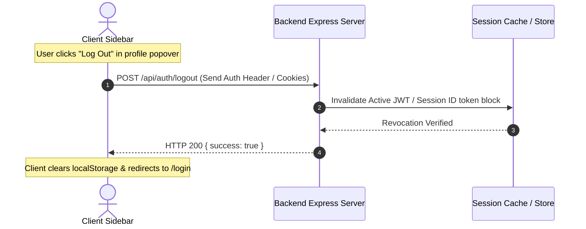

# UseSidebar.md — Sidebar Navigation Integration Guide

This guide describes how to configure, utilize, and integrate the collapsible, responsive [Sidebar.jsx](file:///d:/Hackathon-UI/UI/src/components/Shared/Navigation/Sidebar/Sidebar.jsx) component into a full-stack web application.

---

## 1. Component Architecture & Props reference

The `Sidebar` is a container that holds three main sub-components:

- **SidebarLogo**: Displays company branding and includes the toggle button to trigger sidebar collapsing.
- **SidebarNav**: Maps current active routes, highlighting selected items and rendering collapsible sub-menus.
- **ProfileCard**: Renders active user info (avatar, role, name) and houses the settings/logout popover menu.

### Props Table

| Prop               | Type       | Description                                                                                             |
| :----------------- | :--------- | :------------------------------------------------------------------------------------------------------ |
| `activeTab`        | `String`   | Represents the currently highlighted primary route (e.g., `'Home'`, `'Analytics'`).                     |
| `activeSubTab`     | `String`   | Represents the highlighted secondary route (e.g., `'Insight'`, `'Reports'`).                            |
| `onTabChange`      | `Function` | Callback triggered when a main menu navigation item is clicked. Returns the label string.               |
| `onSubTabChange`   | `Function` | Callback triggered when a nested sub-tab is clicked. Returns the label string.                          |
| `isCollapsed`      | `Boolean`  | Dictates if the sidebar layout is collapsed to its minimal width (`80px`).                              |
| `onToggleCollapse` | `Function` | Toggles the `isCollapsed` layout state in the parent layout wrapper.                                    |
| `isMobileOpen`     | `Boolean`  | Controls sidebar sliding transition into mobile screens as a drawer overlay.                            |
| `onMobileClose`    | `Function` | Callback to close the mobile slide-out view (triggered on menu selection or clicking overlay backdrop). |
| `profileData`      | `Object`   | Active user metadata payload: `{ name, role, initials, avatarUrl }`.                                    |
| `onLogout`         | `Function` | Callback triggered when clicking "Log Out" from the ProfileCard settings popover.                       |

---

## 2. Full-Stack State & URL Sync Strategy

To ensure seamless navigation and bookmark support, keep the sidebar state synchronized with the browser location URL rather than relying solely on ephemeral React states.

### A. URL Mapping Diagram

```
/dashboard/home        ==> activeTab="Home"
/dashboard/analytics   ==> activeTab="Analytics"
/dashboard/analytics/insight  ==> activeTab="Analytics", activeSubTab="Insight"
/dashboard/analytics/reports  ==> activeTab="Analytics", activeSubTab="Reports"
/dashboard/settings    ==> activeTab="Settings"
```

### B. Client Router Synchronization (Vite / React Router v7)

In your parent dashboard layout, parse the current path to feed props dynamically:

```javascript
import React, { useState } from 'react';
import { useLocation, useNavigate, Outlet } from 'react-router';
import Sidebar from '@/components/Shared/Navigation/Sidebar/Sidebar';

export function DashboardWrapper() {
    const location = useLocation();
    const navigate = useNavigate();
    const [isCollapsed, setIsCollapsed] = useState(false);

    // 1. Derive active navigation tabs from location path
    const currentPath = location.pathname;

    let activeTab = 'Home';
    let activeSubTab = '';

    if (currentPath.includes('/dashboard/analytics')) {
        activeTab = 'Analytics';
        if (currentPath.includes('/insight')) activeSubTab = 'Insight';
        if (currentPath.includes('/reports')) activeSubTab = 'Reports';
    } else if (currentPath.includes('/dashboard/settings')) {
        activeTab = 'Settings';
        if (currentPath.includes('/account')) activeSubTab = 'Account';
        if (currentPath.includes('/general')) activeSubTab = 'General';
    }

    // 2. Handle Tab Change redirects
    const handleTabChange = (tabName) => {
        switch (tabName) {
            case 'Home':
                navigate('/dashboard/home');
                break;
            case 'Analytics':
                navigate('/dashboard/analytics/insight');
                break;
            case 'Settings':
                navigate('/dashboard/settings/general');
                break;
            default:
                navigate('/dashboard/home');
        }
    };

    const handleSubTabChange = (subTabName) => {
        if (activeTab === 'Analytics') {
            navigate(`/dashboard/analytics/${subTabName.toLowerCase()}`);
        } else if (activeTab === 'Settings') {
            navigate(`/dashboard/settings/${subTabName.toLowerCase()}`);
        }
    };

    return (
        <div className="dashboard-layout-root">
            <Sidebar
                activeTab={activeTab}
                activeSubTab={activeSubTab}
                onTabChange={handleTabChange}
                onSubTabChange={handleSubTabChange}
                isCollapsed={isCollapsed}
                onToggleCollapse={() => setIsCollapsed(!isCollapsed)}
                profileData={{ name: 'Alex Mercer', role: 'Administrator', initials: 'AM' }}
                onLogout={() => {
                    localStorage.removeItem('jwt');
                    navigate('/login');
                }}
            />
            <main className="dashboard-content-panel">
                <Outlet />
            </main>
        </div>
    );
}
```

---

## 3. Role-Based Menu Access Control (RBAC)

For security and compliance, customize visible navigation menu links based on the authenticated user's role:

### A. Client-Side Route Definition Filter

Before rendering `SidebarNav`, filter links using role boundaries:

```javascript
// SidebarNav.jsx Integration
function SidebarNav({ activeItem, onItemChange, activeSubItem, onSubItemChange, isCollapsed, userRole }) {
  const allNavItems = [
    { label: 'Home', icon: <HomeIcon />, roles: ['Workspace Member', 'Team Manager', 'Administrator'] },
    { label: 'Analytics', icon: <AnalyticsIcon />, subTabs: ['Insight', 'Reports'], roles: ['Team Manager', 'Administrator'] },
    { label: 'Settings', icon: <SettingsIcon />, roles: ['Administrator'] }
  ]

  // Filter items matching user permissions
  const visibleItems = allNavItems.filter(item => item.roles.includes(userRole))

  return (
    <nav className="sidebar-nav-container">
      {visibleItems.map(item => (
         // render menu components...
      ))}
    </nav>
  )
}
```

---

## 4. Full-Stack Data & Session Lifecycle

The profile avatar metadata and logout actions interact with backend endpoints:



### A. Profile Data Fetch API Endpoint

- **Endpoint**: `GET /api/users/profile`
- **Response Payload**:

```json
{
    "name": "Itesh Prajapati",
    "role": "Team Manager",
    "initials": "IP",
    "avatarUrl": "https://cdn.example.com/avatars/user-98.png"
}
```

### B. Session Logout Hook Example (Express.js)

Ensure tokens are destroyed server-side to prevent replay attacks:

```javascript
// Auth Route Handler
router.post('/api/auth/logout', authenticateToken, async (req, res) => {
    try {
        const token = req.headers['authorization']?.split(' ')[1];

        // 1. Store token in Redis Blacklist until original JWT expiry duration has elapsed
        await redis.setex(`blacklist:${token}`, jwtExpiryTimeSeconds, 'true');

        // 2. Clear server-side refresh cookies if using HttpOnly cookie mechanics
        res.clearCookie('refreshToken', { httpOnly: true, secure: true, sameSite: 'strict' });

        return res.status(200).json({ success: true, message: 'Logged out successfully.' });
    } catch (error) {
        console.error(error);
        return res.status(500).json({ message: 'Internal server error during logout.' });
    }
});
```
