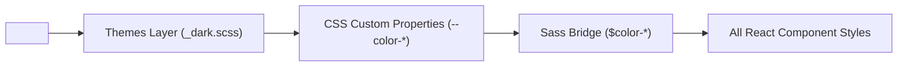

# Theme System & Runtime Switching Guide

This directory contains the **Semantic Token & Theme Layer** (Tier 2 of the 3-tiered styling architecture). It defines runtime CSS Custom Property mappings for the application's themes (Light, Dark, and System).

---

## 1. Directory Structure

```text
foundation/themes/
├── _light.scss       # Default light theme token mappings on :root
├── _dark.scss        # Dark theme token mappings & mixins
└── README.md         # Architecture and usage documentation (this file)
```

---

## 2. How Themes Work

Themes map context-free primitive tokens (`foundation/tokens/`) to context-aware semantic tokens (`--color-white`, `--color-primary`, `--color-gray-100`, etc.).

Because components only consume SCSS variables linked to these CSS custom properties (via `variables.scss`), the entire application's theme switches instantly at runtime by simply toggling the `data-theme` attribute on the root `<html>` element without re-rendering or re-compiling stylesheets.



---

## 3. Theme Activation & CSS Mechanics

Themes are controlled via the `data-theme` attribute on `document.documentElement` (`<html>`):

| Mode       | Selector Triggered                | Active Theme File                                      | Behavior                                                         |
| :--------- | :-------------------------------- | :----------------------------------------------------- | :--------------------------------------------------------------- |
| **Light**  | `:root`, `[data-theme="light"]`   | `_light.scss`                                          | Default crisp white canvas and dark typography                   |
| **Dark**   | `[data-theme="dark"]`             | `_dark.scss`                                           | Dark zinc/slate surfaces, light typography, and adjusted shadows |
| **System** | `:root:not([data-theme="light"])` | `_dark.scss` via `@media (prefers-color-scheme: dark)` | Automatically matches the user's OS dark/light mode preference   |

### Selector Definition in `_dark.scss`

```scss
@mixin dark-theme-tokens {
    // Semantic token overrides for dark mode
    --color-white: var(--primi-gray-800);
    --color-gray-50: var(--primi-gray-900);
    --color-primary: var(--primi-gray-50);
    // ...
}

// 1. Explicit manual toggle
[data-theme='dark'] {
    @include dark-theme-tokens;
}

// 2. System preference fallback (when not explicitly set to light)
@media (prefers-color-scheme: dark) {
    :root:not([data-theme='light']) {
        @include dark-theme-tokens;
    }
}
```

---

## 4. Semantic Token Mapping Reference

When switching between Light and Dark themes, tokens adapt to maintain visual hierarchy and WCAG contrast:

| Semantic Token     | Light Mode Value               | Dark Mode Value (Monochromatic Minimalism) | UI Role                                          |
| :----------------- | :----------------------------- | :----------------------------------------- | :----------------------------------------------- |
| `--color-white`    | `#fff` (`--primi-white`)       | `#1a1a1a`                                  | Cards, modals, inputs, dropdown surfaces         |
| `--color-black`    | `#000` (`--primi-black`)       | `#ffffff`                                  | Maximum contrast white text                      |
| `--color-gray-50`  | `#fafafb` (`--primi-gray-50`)  | `#121212`                                  | Main application charcoal background             |
| `--color-gray-100` | `#f3f4f6` (`--primi-gray-100`) | `#222222`                                  | Table row hover, subtle containers               |
| `--color-gray-200` | `#e5e7eb` (`--primi-gray-200`) | `#444444`                                  | Crisp borders & dividers                         |
| `--color-gray-300` | `#d1d5db` (`--primi-gray-300`) | `#555555`                                  | Emphasized / active borders                      |
| `--color-gray-400` | `#9ca3af` (`--primi-gray-400`) | `#777777`                                  | Muted borders & placeholders                     |
| `--color-gray-500` | `#6b7280` (`--primi-gray-500`) | `#888888`                                  | Accent & meta labels (soft gray)                 |
| `--color-gray-600` | `#4b5563` (`--primi-gray-600`) | `#b0b0b0`                                  | Secondary text (medium gray)                     |
| `--color-gray-700` | `#374151` (`--primi-gray-700`) | `#cccccc`                                  | Body text                                        |
| `--color-gray-800` | `#1f2937` (`--primi-gray-800`) | `#e0e0e0`                                  | Subheadings (light gray)                         |
| `--color-gray-900` | `#111827` (`--primi-gray-900`) | `#f5f5f5`                                  | Primary headings & high-contrast titles          |
| `--color-primary`  | `var(--primi-gray-900)`        | `#e0e0e0`                                  | Primary buttons & key accents                    |
| `--shadow-*`       | `rgb(0 0 0 / 5%)`              | `rgb(0 0 0 / 60%-80%)`                     | Elevation shadows (deep alpha for dark surfaces) |

---

## 5. How to Handle Theme Changes in Code

### A. Direct DOM Manipulation (Quick / Vanilla JS)

```javascript
// Switch to dark mode
document.documentElement.setAttribute('data-theme', 'dark');

// Switch to light mode
document.documentElement.setAttribute('data-theme', 'light');

// Switch to system OS preference
document.documentElement.removeAttribute('data-theme');
```

### B. Standard React Integration Pattern

```javascript
import { createContext, useContext, useEffect, useState } from 'react';

const ThemeContext = createContext();

export function ThemeProvider({ children }) {
    const [theme, setTheme] = useState(() => {
        return localStorage.getItem('app-theme') || 'system';
    });

    useEffect(() => {
        const root = document.documentElement;
        if (theme === 'system') {
            root.removeAttribute('data-theme');
            localStorage.removeItem('app-theme');
        } else {
            root.setAttribute('data-theme', theme);
            localStorage.setItem('app-theme', theme);
        }
    }, [theme]);

    return <ThemeContext.Provider value={{ theme, setTheme }}>{children}</ThemeContext.Provider>;
}

export const useTheme = () => useContext(ThemeContext);
```

### C. Preventing Theme Flicker on Initial Page Load

To prevent the white flash during initial page load for users with dark theme saved, add a small blocking script inside `<head>` in `index.html`:

```html
<script>
    (function () {
        const savedTheme = localStorage.getItem('app-theme');
        if (savedTheme === 'dark' || savedTheme === 'light') {
            document.documentElement.setAttribute('data-theme', savedTheme);
        }
    })();
</script>
```

---

## 6. Guidelines for Component Developers

1. **Always use Sass bridge variables:**
    ```scss
    @use '@/styles/variables' as variables;

    .card {
        background-color: variables.$color-white; // Automatically light or dark surface
        color: variables.$color-gray-900; // Automatically light or dark text
        border: 1px solid variables.$color-gray-200;
    }
    ```
2. **Never hardcode hex values or primitive tokens in component styles:**
    - ❌ `background-color: #ffffff;`
    - ❌ `background-color: var(--primi-white);`
    - ✅ `background-color: variables.$color-white;`
3. **Use CSS `color-mix()` for derived opacity or tints:**
    ```scss
    // For 10% tinted background:
    background-color: color-mix(in srgb, variables.$color-primary 10%, transparent);
    ```
