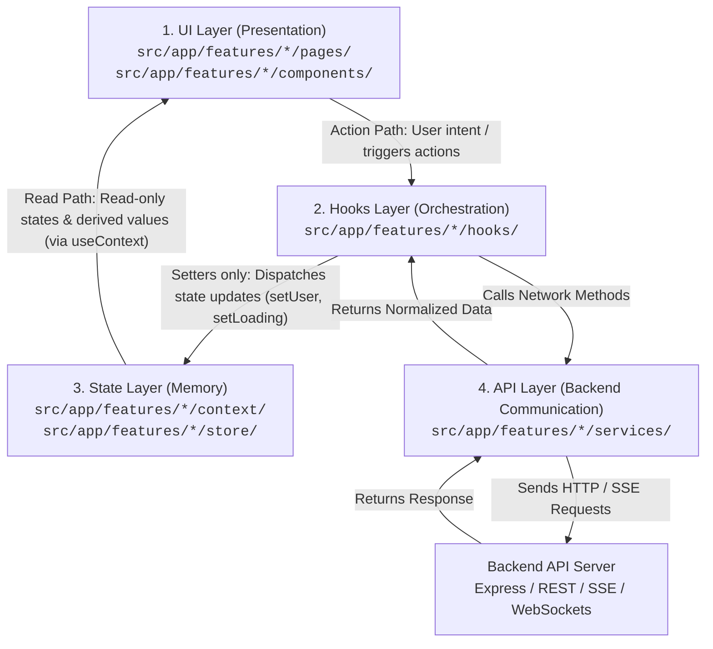

# Frontend Architecture: 4-Layer Model (React)

This document establishes the official frontend architectural guidelines for the **Apex Template**. The client application strictly separates concerns into **4 distinct layers**:



---

## 1. Quick Layer Overview (Read Path vs. Action Path)

| Layer                        | Responsibility                                                                                     | What It Consumes                                                                                                                                                      | What It Exports / Exposes                                                                               |
| ---------------------------- | -------------------------------------------------------------------------------------------------- | --------------------------------------------------------------------------------------------------------------------------------------------------------------------- | ------------------------------------------------------------------------------------------------------- |
| **1. UI (Presentation)**     | Renders UI screens, captures user input, displays read-only state/loading/error, triggers actions. | • **State Layer**: Reads read-only values (`user`, `loading`, `error`) via `useContext`.<br>• **Hooks Layer**: Calls action handlers (`handleLogin`, `handleCreate`). | JSX Components, Form Pages, Views.                                                                      |
| **2. Hooks (Orchestration)** | Coordinates async flows: calls API services, catches errors, invokes State setters.                | • **State Layer**: Consumes **setters only** (`setUser`, `setLoading`, `setError`).<br>• **API Layer**: Calls service methods (`loginApi`).                           | **Action handlers only** (`{ handleLogin, handleLogout }`).<br>_(Does NOT re-export state or setters!)_ |
| **3. State (Memory)**        | Passive memory store for shared data and derived values (`isAuthenticated`). Pure storage.         | React `useState` / `useMemo`.                                                                                                                                         | Value object containing **read-only states** + **setters**.                                             |
| **4. API (Communication)**   | Pure HTTP/SSE network calls. Encapsulates Axios instances, URLs, and token headers.                | Backend HTTP Endpoints.                                                                                                                                               | Async functions returning normalized data.                                                              |

---

## 2. Directory Layout Convention

Every feature in `src/app/features/` adheres to this modular structure:

```
src/app/features/
  ├── auth/
  │   ├── components/            # Sub-components & form elements (UI Layer)
  │   ├── login/                 # Page layouts & coordinators (UI Layer)
  │   ├── register/              # Page layouts & coordinators (UI Layer)
  │   ├── hooks/                 # Custom orchestration hooks (Hooks Layer)
  │   │   ├── useAuth.js         # Returns action handlers ONLY ({ handleLogin, handleLogout })
  │   │   └── useDerivedProfile.js
  │   ├── context/               # React Context Providers (State Layer)
  │   │   ├── AuthContext.js
  │   │   └── auth.context.jsx   # Stores { user, loading, error, setUser, setLoading, setError }
  │   └── services/              # API Clients & Axios wrappers (API Layer)
  │       └── api.js
  │
  ├── dashboard/                 # Dashboard view coordinators & layouts
  ├── analytics/                 # KPI charts, data aggregations, insights
  ├── settings/                  # User profile and general preferences
  └── ai/                        # AI Copilot chatbot (SSE streaming & stores)
```

---

## 3. Deep Dive into the 4 Layers

### Layer 1: UI Layer (Presentation)

**Location:** `src/app/features/*/pages/` and `src/app/features/*/components/`

**Responsibility:**

- Render declarative JSX based on props and context data.
- Read **read-only states and derived values** directly from Context via `useContext(FeatureContext)`.
- Invoke action handlers from the orchestration hook (`useAuth()`).
- Display loading spinners (`<Spinner />`), error messages, and toasts.
- Manage route navigation (`useNavigate()`, `<Navigate />`).

**UI must NOT:**

- Access or invoke state **setters** (`setUser`, `setLoading`, `setError`) directly from Context. Setters belong strictly to Hooks!
- Call API services or `axios`/`fetch` directly.
- Access cookies or `localStorage` directly.
- Contain business validation or token decoding rules.

```jsx
// Example: UI Component following the Read vs Action separation
import { useState, useContext } from 'react';
import { AuthContext } from '@/app/features/auth/context/auth.context';
import { useAuth } from '@/app/features/auth/hooks/useAuth';
import InputField from '@/components/Shared/Form/InputField/InputField';
import Button from '@/components/Shared/Buttons/Button/Button';
import Spinner from '@/components/Shared/Feedback/Spinner/Spinner';

export default function LoginForm() {
    // 1. Read Path: UI reads states and derived values directly from Context
    const { loading, error } = useContext(AuthContext);

    // 2. Action Path: UI calls orchestration hook for action handlers ONLY
    const { handleLogin } = useAuth();

    const [email, setEmail] = useState('');
    const [password, setPassword] = useState('');

    const onSubmit = async (e) => {
        e.preventDefault();
        try {
            await handleLogin(email, password);
        } catch (err) {
            // UI only handles visual feedback
        }
    };

    return (
        <form onSubmit={onSubmit} className="login-form">
            <InputField
                label="Email Address"
                type="email"
                value={email}
                onChange={(e) => setEmail(e.target.value)}
                required
            />
            <InputField
                label="Password"
                type="password"
                value={password}
                onChange={(e) => setPassword(e.target.value)}
                required
            />
            {error && <p className="error-message">{error.message || 'Login failed'}</p>}
            <Button type="submit" disabled={loading}>
                {loading ? <Spinner size="sm" /> : 'Sign In'}
            </Button>
        </form>
    );
}
```

---

### Layer 2: Hooks Layer (Orchestration)

**Location:** `src/app/features/*/hooks/`

**Responsibility:**

- Import **setters only** from Context (`const { setUser, setLoading, setError } = useContext(AuthContext)`).
- Execute async flows: flip loading flags on/off, call API functions, update state setters on success, catch and set errors.
- Export **ONLY action handlers / functions** (e.g. `{ handleLogin, handleLogout, handleRegister }`).
- **Never re-export state variables or setters** through the hook.

```javascript
// Example: src/app/features/auth/hooks/useAuth.js (Corrected Pattern)
import { useCallback, useContext } from 'react';
import { AuthContext } from '../context/auth.context';
import { login, logout } from '../services/api';

export function useAuth() {
    const context = useContext(AuthContext);
    if (!context) {
        throw new Error('useAuth must be used within an AuthProvider');
    }

    // Hook ONLY consumes setters from the State layer
    const { setUser, setLoading, setError } = context;

    const handleLogin = useCallback(
        async (email, password) => {
            setLoading(true);
            setError(null);
            try {
                const data = await login({ email, password });
                setUser(data.user);
                return data;
            } catch (err) {
                const formattedError = err.response?.data || { message: err.message };
                setError(formattedError);
                throw formattedError;
            } finally {
                setLoading(false);
            }
        },
        [setError, setLoading, setUser],
    );

    const handleLogout = useCallback(async () => {
        setLoading(true);
        try {
            await logout();
            setUser(null);
        } catch (err) {
            setError(err);
        } finally {
            setLoading(false);
        }
    }, [setError, setLoading, setUser]);

    // Hook exports ACTION HANDLERS ONLY. No state variables, no setters!
    return {
        handleLogin,
        handleLogout,
    };
}
```

---

### Layer 3: State Layer (Memory)

**Location:** `src/app/features/*/context/` or `src/app/features/*/store/`

**Responsibility:**

- Hold shared state values (`user`, `leads`, `loading`, `error`).
- Compute derived values (`isAuthenticated = Boolean(user)`).
- Expose state variables for the **UI Read Path** and setter functions for the **Hooks Action Path**.
- Pure storage: strictly no async/await, no API calls, no routing logic.

```jsx
// Example: src/app/features/auth/context/auth.context.jsx
import { createContext, useState, useMemo } from 'react';

export const AuthContext = createContext(null);

export function AuthProvider({ children }) {
    const [user, setUser] = useState(null);
    const [loading, setLoading] = useState(false);
    const [error, setError] = useState(null);

    const value = useMemo(
        () => ({
            // Read-only values (consumed by UI)
            user,
            isAuthenticated: Boolean(user),
            loading,
            error,

            // Setters (consumed by Hooks only)
            setUser,
            setLoading,
            setError,
        }),
        [user, loading, error],
    );

    return <AuthContext.Provider value={value}>{children}</AuthContext.Provider>;
}
```

---

### Layer 4: API Layer (Backend Communication)

**Location:** `src/app/features/*/services/`

**Responsibility:**

- Pure HTTP client functions using Axios.
- Parameter serialization and response/error normalization.
- Pure infrastructure: no React hooks, no state mutation.

```javascript
// Example: src/app/features/auth/services/api.js
import axios from 'axios';

const apiClient = axios.create({
    baseURL: '/api/auth',
    withCredentials: true,
});

export const login = async (credentials) => {
    const response = await apiClient.post('/login', credentials);
    return response.data;
};

export const logout = async () => {
    const response = await apiClient.post('/logout');
    return response.data;
};
```

---

## 4. Architectural Evolution: Legacy vs. Corrected Approach

> [!IMPORTANT]
> **Legacy Pattern in Codebase vs. Corrected Pattern for Upcoming Features:**
>
> - **Legacy Pattern (found in parts of existing code)**: Hooks were returning everything together: `{ user, setUser, loading, setLoading, error, setError, handleLogin, ... }`. This leaked setters to the UI and coupled state reading to hook exports.
> - **Corrected Pattern (Standard for all new and upcoming features)**:
>     - **UI**: Reads state directly via `useContext(FeatureContext)` (read-only states/derived values only; never calls setters).
>     - **Hooks**: Consume setters from Context and export **action handlers only** (`return { handleAction1, handleAction2 }`).
>     - **Setters**: Are never called by UI components; only invoked inside Hook async flows.

---

## 5. Strict Communication Rules Matrix

| From Layer | May Talk To                                                                                                                | Forbidden Targets                                                                                            |
| ---------- | -------------------------------------------------------------------------------------------------------------------------- | ------------------------------------------------------------------------------------------------------------ |
| **UI**     | • State Layer (via `useContext` for **read-only states & derived values**)<br>• Hooks Layer (for **action handlers only**) | ❌ State Setters (`setUser`, `setLoading`)<br>❌ API Services<br>❌ Direct Backend URLs<br>❌ Cookies/Tokens |
| **Hooks**  | • State Layer (consumes **setters only**)<br>• API Layer (calls service methods)                                           | ❌ Returning state variables or setters<br>❌ JSX / DOM<br>❌ Direct Route redirects                         |
| **State**  | None (Passive Memory Container)                                                                                            | ❌ API Services<br>❌ Hooks<br>❌ Async / HTTP Logic                                                         |
| **API**    | Backend Server only                                                                                                        | ❌ React State<br>❌ React Hooks<br>❌ UI / Toasts                                                           |

---

## 6. Dynamic Routing & Multi-Role RBAC (Role-Based Access Control)

### A. Zero-Conflict Feature Route Discovery

To avoid merge conflicts during multi-developer and hackathon development, `src/app/App.routes.jsx` never contains hardcoded feature routes.

- **Engine:** `src/app/routes.loader.js` scans all `src/app/features/**/*.routes.jsx` files using Vite's `import.meta.glob`.
- **Developer Flow:** Each feature folder exports its own `<feature>.routes.jsx`. Developers **never** edit `App.routes.jsx`.

### B. Standard `<feature>.routes.jsx` Structure

Every new feature defines its RBAC permissions, optional sidebar metadata, and routes in a single file:

```jsx
// src/app/features/leads/leads.routes.jsx
import { LeadsProvider } from './context/leads.context';
import LeadsPage from './pages/LeadsPage';

export default {
    // 🛡️ Multi-Role RBAC: roles authorized to access this feature
    allowedRoles: ['admin', 'manager', 'sales_rep'],

    // 🧭 Optional Navigation Metadata for the Sidebar
    navItem: {
        label: 'Leads',
        path: '/dashboard/user/leads',
        icon: 'Users',
        roles: ['admin', 'manager', 'sales_rep'],
    },

    // 🛣️ Feature Routes (automatically wrapped with ProtectedRoute)
    routes: [
        {
            path: 'leads',
            element: (
                <LeadsProvider>
                    <LeadsPage />
                </LeadsProvider>
            ),
        },
    ],
};
```

### C. Multi-Role RBAC Architecture

Our routing and navigation implement enterprise-grade Unified RBAC:

1. **Route Level (`ProtectedRoute.jsx`)**:
    - Accepts `allowedRoles` (e.g. `allowedRoles={['admin', 'manager', 'sales_rep']}`).
    - Automatically checks `user.role` (case-insensitive).
    - If unauthorized, displays `<ForbiddenPage />` (403) with a safe return CTA without triggering redirect loops.

2. **Navigation Level (`SidebarNav.jsx`)**:
    - Inspects each `navItem.roles` array against `user.role`.
    - Unauthorized navigation items are automatically filtered and hidden from the sidebar.
