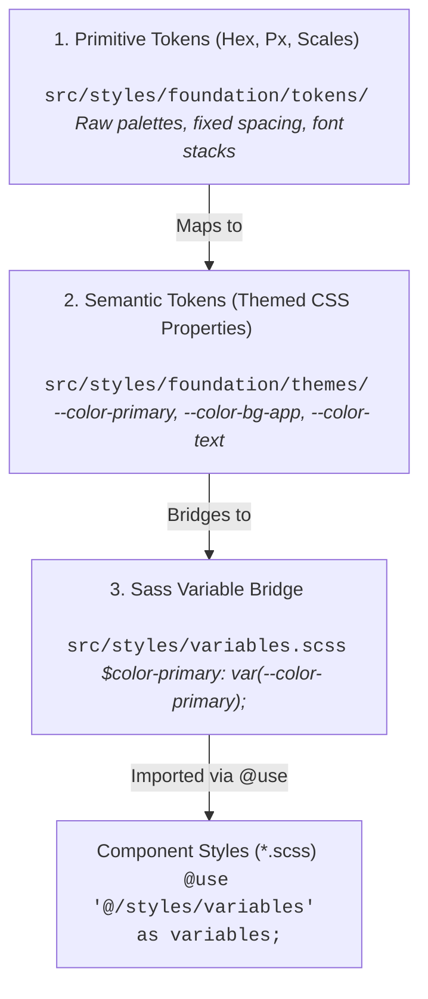

# Design System & SCSS Architecture Guide

This document details the styling architecture, 3-tiered design token system, Dart Sass `@use` conventions, and **zero-`!important` architecture rules** used across the **Apex Template** frontend client.

---

## 1. The 3-Tiered Token System



### Tier 1: Primitive Tokens (`src/styles/foundation/tokens/`)

Primitives define raw, context-agnostic design values registered directly onto `:root`:

- `_colors.scss`: Base color scale (`--primi-gray-50` to `--primi-gray-900`, blue, green, red, amber, purple).
- `_spacing.scss`: Fixed spacing increments (`--primi-spacing-xs: 4px;` to `--primi-spacing-2xl: 32px;`).
- `_radius.scss`: Layout corner radii (`--primi-radius-tiny: 6px;` to `--primi-radius-xlarge: 32px;`).
- `_shadows.scss`: Consistent shadow presets (`--primi-shadow-sm`, `--primi-shadow-md`, `--primi-shadow-premium`).
- `_typography.scss`: Font family stacks (`'Plus Jakarta Sans'`, `'Bodoni Moda'`) and scale metrics.
- `_z-index.scss`: Global z-index stack (`--primi-z-dropdown: 1000;`, `--primi-z-modal: 1050;`, `--primi-z-toast: 1100;`).

### Tier 2: Semantic Tokens (`src/styles/foundation/themes/`)

Semantic tokens map raw primitives to UI roles and intent. This layer enables seamless light/dark theme switching:

- `_light.scss`: Default light theme definitions on `:root`.
- `_dark.scss`: Dark theme overrides active under `[data-theme='dark']` and `@media (prefers-color-scheme: dark)`.

### Tier 3: Sass Variable Bridge (`src/styles/variables.scss`)

Maps Sass `$` variables to the CSS custom properties, providing static linting and editor autocomplete:

```scss
$color-primary: var(--color-primary);
$color-bg-app: var(--color-bg-app);
$color-bg-card: var(--color-bg-card);
$color-text-primary: var(--color-text-primary);
```

---

## 2. SCSS Best Practices & Rules

### Rule 1: Always Use `@use` (Never `@import`)

```scss
// ✅ CORRECT
@use '@/styles/variables' as variables;

.my-card {
    background-color: variables.$color-bg-card;
    border-radius: variables.$radius-medium;
    padding: variables.$spacing-md;
}

// ❌ WRONG
@import '@/styles/variables.scss';
```

### Rule 2: Never Hardcode Hex Codes or Pixels

Always use design tokens for colors, spacing, and radii:

```scss
// ❌ WRONG
.custom-btn {
    background-color: #111827;
    padding: 12px 16px;
    border-radius: 8px;
}

// ✅ CORRECT
.custom-btn {
    background-color: variables.$color-primary;
    padding: variables.$spacing-sm variables.$spacing-md;
    border-radius: variables.$radius-small;
}
```

### Rule 3: Use Native `color-mix()` for Color Shading

Because Sass variables resolve to CSS custom properties at runtime, Sass compilation functions (`darken()`, `lighten()`, `color.adjust()`) will fail to compile. Use native CSS `color-mix()` instead:

```scss
// ✅ CORRECT: Modern native CSS color blending
.custom-card {
    background-color: color-mix(in srgb, variables.$color-primary 10%, transparent);
    border-color: color-mix(in srgb, variables.$color-gray-200 80%, black);
}

// ❌ WRONG: Will fail at build time
.custom-card {
    background-color: lighten(variables.$color-primary, 10%);
}
```

### Rule 4: Responsive Media Queries

Use the predefined mixins in `variables.scss`:

```scss
@use '@/styles/variables' as variables;

.responsive-grid {
    display: grid;
    grid-template-columns: repeat(3, 1fr);
    gap: variables.$spacing-lg;

    @include variables.tablet {
        grid-template-columns: repeat(2, 1fr);
        gap: variables.$spacing-md;
    }

    @include variables.mobile {
        grid-template-columns: 1fr;
        gap: variables.$spacing-sm;
    }
}
```

### Rule 5: Built-in Micro-Animations & Transitions

```scss
.interactive-element {
    @include variables.transition-ease;

    &:hover {
        transform: translateY(-2px);
        box-shadow: variables.$shadow-md;
    }
}
```

---

## 3. Zero-`!important` Architecture Rule

The Apex Template codebase enforces **0 `!important` occurrences across all stylesheets**.

To override styles cleanly without `!important`:

1. **Increase Specificity Naturally**: Chain classes or parent containers:
    ```scss
    // Better specificity without !important
    .data-view-container .table-header {
        background-color: variables.$color-gray-100;
    }
    ```
2. **Use Component Props for Variants**: Pass a prop (e.g. `variant="secondary"`, `size="sm"`) rather than writing CSS overrides.
3. **Use CSS Custom Property Holes**: Allow parent components to override custom properties:
    ```scss
    .custom-widget {
        --widget-bg: #{variables.$color-bg-card};
        background-color: var(--widget-bg);
    }

    .custom-widget--highlighted {
        --widget-bg: #{variables.$color-blue-accent};
    }
    ```

---

## 4. Theme Switching Support (Dark Mode)

Dark mode is controlled dynamically via the `data-theme` attribute on the `<html>` or `<body>` element:

```html
<!-- Light Mode -->
<html data-theme="light">
    <!-- Dark Mode -->
    <html data-theme="dark"></html>
</html>
```

### Key Theme Color Tokens:

| Token Name               | Light Value | Dark Value | Purpose                             |
| ------------------------ | ----------- | ---------- | ----------------------------------- |
| `--color-bg-app`         | `#fafafb`   | `#121212`  | Main page background                |
| `--color-bg-card`        | `#ffffff`   | `#1a1a1a`  | Card & surface container background |
| `--color-text-primary`   | `#111827`   | `#e0e0e0`  | Main headings & body text           |
| `--color-text-secondary` | `#6b7280`   | `#a0a0a0`  | Subtitles, labels, timestamps       |
| `--color-border-subtle`  | `#f3f4f6`   | `#2a2a2a`  | Dividers & light outlines           |
| `--color-border-strong`  | `#e5e7eb`   | `#444444`  | Card & table borders                |
