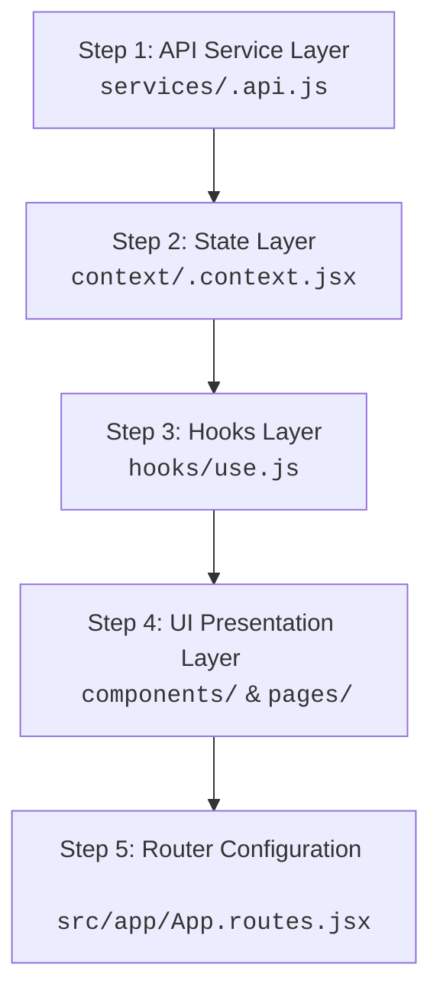

# Feature Development Guide: Implementing New Features (4-Layer Pattern)

This guide provides a step-by-step developer playbook for adding new frontend features to the **Apex Template** while strictly respecting the **4-Layer Architecture** (`UI` → `Hooks` → `State` → `API`) with separate **Read Path** (UI consumes Context directly for read-only state) and **Action Path** (UI calls Hooks for action handlers).

---

## 1. Step-by-Step Feature Workflow

When adding any new feature (e.g. `leads`, `invoices`, `contacts`, `tickets`):



---

## 2. Practical End-to-End Walkthrough: Building the `Leads` Feature

Let's walk through implementing a complete CRM `Leads` module.

### Step 1: Create Feature Directory Structure

```
src/app/features/leads/
  ├── components/
  │   ├── LeadCard/
  │   └── LeadFormModal/
  ├── pages/
  │   └── LeadsPage.jsx
  ├── hooks/
  │   └── useLeads.js           <-- Exports action handlers ONLY
  ├── context/
  │   └── leads.context.jsx     <-- Stores state, derived values, & setters
  └── services/
      └── leads.api.js          <-- Pure Axios requests
```

---

### Step 2: Build the API Layer (`services/leads.api.js`)

Pure Axios requests. No React hooks or state.

```javascript
// src/app/features/leads/services/leads.api.js
import axios from 'axios';

const api = axios.create({
    baseURL: '/api/leads',
    withCredentials: true,
});

export const fetchLeads = async (params = {}) => {
    const response = await api.get('/', { params });
    return response.data;
};

export const createLead = async (leadData) => {
    const response = await api.post('/', leadData);
    return response.data;
};

export const updateLeadStatus = async (leadId, status) => {
    const response = await api.patch(`/${leadId}/status`, { status });
    return response.data;
};

export const deleteLead = async (leadId) => {
    const response = await api.delete(`/${leadId}`);
    return response.data;
};
```

---

### Step 3: Build the State Layer (`context/leads.context.jsx`)

Pure state container. Stores leads array, loading flags, error objects, and exposes setters.

```jsx
// src/app/features/leads/context/leads.context.jsx
import { createContext, useState, useMemo } from 'react';

export const LeadsContext = createContext(null);

export function LeadsProvider({ children }) {
    const [leads, setLeads] = useState([]);
    const [selectedLead, setSelectedLead] = useState(null);
    const [loading, setLoading] = useState(false);
    const [error, setError] = useState(null);

    // Derived values
    const qualifiedLeadsCount = useMemo(
        () => leads.filter((lead) => lead.status === 'qualified').length,
        [leads],
    );

    const value = useMemo(
        () => ({
            // 1. Read-only values (consumed by UI via useContext)
            leads,
            selectedLead,
            loading,
            error,
            qualifiedLeadsCount,

            // 2. Setters (consumed by Hooks only)
            setLeads,
            setSelectedLead,
            setLoading,
            setError,
        }),
        [leads, selectedLead, loading, error, qualifiedLeadsCount],
    );

    return <LeadsContext.Provider value={value}>{children}</LeadsContext.Provider>;
}
```

---

### Step 4: Build the Hooks Layer (`hooks/useLeads.js`)

Orchestrates async API calls and updates State setters. Returns **action handlers only** without re-exporting state or setters!

```javascript
// src/app/features/leads/hooks/useLeads.js
import { useContext, useCallback } from 'react';
import { LeadsContext } from '../context/leads.context';
import * as leadsApi from '../services/leads.api';

export function useLeads() {
    const context = useContext(LeadsContext);
    if (!context) {
        throw new Error('useLeads must be used within a LeadsProvider');
    }

    // Hook ONLY consumes setters from the State layer
    const { setLeads, setSelectedLead, setLoading, setError } = context;

    const loadLeads = useCallback(
        async (params) => {
            setLoading(true);
            setError(null);
            try {
                const data = await leadsApi.fetchLeads(params);
                setLeads(data.leads || data);
                return data;
            } catch (err) {
                setError(err.response?.data || err);
                throw err;
            } finally {
                setLoading(false);
            }
        },
        [setError, setLoading, setLeads],
    );

    const handleCreateLead = useCallback(
        async (leadData) => {
            setLoading(true);
            setError(null);
            try {
                const newLead = await leadsApi.createLead(leadData);
                setLeads((prev) => [newLead, ...prev]);
                return newLead;
            } catch (err) {
                setError(err.response?.data || err);
                throw err;
            } finally {
                setLoading(false);
            }
        },
        [setError, setLoading, setLeads],
    );

    const handleStatusChange = useCallback(
        async (leadId, newStatus) => {
            try {
                await leadsApi.updateLeadStatus(leadId, newStatus);
                setLeads((prev) =>
                    prev.map((lead) =>
                        lead.id === leadId ? { ...lead, status: newStatus } : lead,
                    ),
                );
            } catch (err) {
                setError(err.response?.data || err);
                throw err;
            }
        },
        [setError, setLeads],
    );

    // Return ACTION HANDLERS ONLY. No state variables, no setters!
    return {
        loadLeads,
        handleCreateLead,
        handleStatusChange,
        setSelectedLead,
    };
}
```

---

### Step 5: Build UI Components & Pages

- **Read Path**: Reads read-only values (`leads`, `loading`, `error`, `qualifiedLeadsCount`) directly from `useContext(LeadsContext)`.
- **Action Path**: Invokes action methods (`loadLeads`, `handleCreateLead`) from `useLeads()`.

```jsx
// src/app/features/leads/pages/LeadsPage.jsx
import { useEffect, useState, useContext } from 'react';
import { LeadsContext } from '../context/leads.context';
import { useLeads } from '../hooks/useLeads';
import AdvancedTable from '@/components/Shared/DataDisplay/AdvancedTable/AdvancedTable';
import StatCard from '@/components/Shared/DataDisplay/StatCard/StatCard';
import Button from '@/components/Shared/Buttons/Button/Button';
import Spinner from '@/components/Shared/Feedback/Spinner/Spinner';
import { Users, Plus } from 'lucide-react';
import './LeadsPage.scss';

const columns = [
    { key: 'name', label: 'Lead Name', sortable: true },
    { key: 'company', label: 'Company', sortable: true },
    { key: 'email', label: 'Email' },
    { key: 'status', label: 'Status', sortable: true },
    { key: 'value', label: 'Potential Value', sortable: true },
];

export default function LeadsPage() {
    // 1. Read Path: Read state directly from Context
    const { leads, loading, error, qualifiedLeadsCount } = useContext(LeadsContext);

    // 2. Action Path: Call hook for action handlers
    const { loadLeads, handleCreateLead } = useLeads();
    const [isCreateOpen, setIsCreateOpen] = useState(false);

    useEffect(() => {
        loadLeads();
    }, [loadLeads]);

    return (
        <div className="leads-page">
            <div className="leads-page__header">
                <div>
                    <h1>Leads Pipeline</h1>
                    <p>Manage and convert incoming CRM sales leads</p>
                </div>
                <Button onClick={() => setIsCreateOpen(true)} icon={Plus}>
                    Add New Lead
                </Button>
            </div>

            <div className="leads-page__stats">
                <StatCard title="Total Leads" value={leads.length} icon={Users} />
                <StatCard
                    title="Qualified Leads"
                    value={qualifiedLeadsCount}
                    trend="+14%"
                    trendPositive
                />
            </div>

            <div className="leads-page__content">
                {loading && leads.length === 0 ? (
                    <Spinner />
                ) : (
                    <AdvancedTable
                        data={leads}
                        columns={columns}
                        searchPlaceholder="Search leads by name or company..."
                    />
                )}
            </div>
        </div>
    );
}
```

---

### Step 6: Define Zero-Conflict Route & Navigation (`leads.routes.jsx`)

Each feature defines its own routes in `src/app/features/<feature>/<feature>.routes.jsx`. `App.routes.jsx` automatically discovers and mounts it into the route tree via Vite's `import.meta.glob` — **developers never need to edit `App.routes.jsx` directly!**

```jsx
// src/app/features/leads/leads.routes.jsx
import { LeadsProvider } from './context/leads.context';
import LeadsPage from './pages/LeadsPage';

export default {
    // Multi-Role RBAC: specify which roles can access this feature
    allowedRoles: ['admin', 'manager', 'sales_rep'],

    // Optional Navigation Metadata for the Sidebar
    navItem: {
        label: 'Leads',
        path: '/dashboard/user/leads',
        icon: 'Users',
        roles: ['admin', 'manager', 'sales_rep'],
    },

    // Feature Routes
    routes: [
        {
            path: 'leads',
            element: (
                <LeadsProvider>
                    <LeadsPage />
                </LeadsProvider>
            ),
        },
    ],
};
```

---

## 3. Checklist for High-Quality Feature Implementation

- [ ] **Read Path Check**: Did the UI consume read-only state directly via `useContext(FeatureContext)` without calling any state setters?
- [ ] **Action Path Check**: Did the hook export only action handlers (`return { handleAction1, handleAction2 }`) without exporting state variables or setters?
- [ ] **API Check**: Is network communication encapsulated inside `services/<feature>.api.js`?
- [ ] **Reusability Check**: Did you use `@/components/Shared/` buttons, inputs, dialogs, and tables instead of creating raw HTML elements?
- [ ] **SCSS Check**: Did you use `@use '@/styles/variables' as variables;` and semantic tokens?
- [ ] **Performance Check**: Are table filters debounced and row clicks memoized with `useCallback`?
- [ ] **Route Matching**: Are sub-views URL-driven using `<Outlet />` and React Router v7 child routes?
