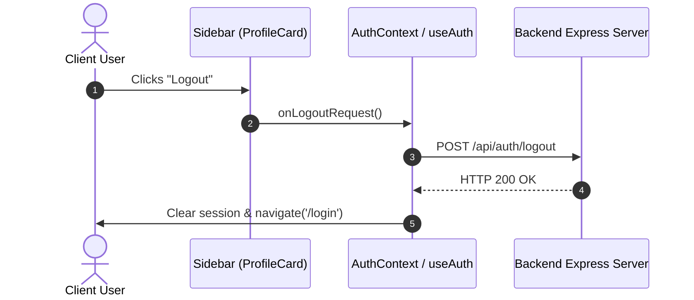

# Sidebar

The primary application navigation sidebar supporting collapsible states (desktop `260px` → collapsed `64px`), flyout sub-menu popovers on hover, logo collapse interactions, active route highlighting via React Router `useLocation()`, role-based menu filtering, and mobile drawer overlays.

---

## 1. Import Path

```javascript
import Sidebar from '@/components/Shared/Navigation/Sidebar/Sidebar';
```

---

## 2. Component Architecture & Subcomponents

The `Sidebar` is composed of three modular subcomponents:

- **SidebarLogo**: Displays company branding and houses the collapse toggle trigger button.
- **SidebarNav**: Maps active routes, highlights selected items, handles pin/unpin toggles, and renders flyout sub-tabs on hover when collapsed.
- **ProfileCard**: Renders active user information (avatar, name, role) and contains the settings/logout action menu.

---

## 3. Props Specification

As a shared primitive, `Sidebar` is 100% pure and decoupled from domain state:

| Prop Name           | Type          | Default | Required | Description                                                                 |
| ------------------- | ------------- | ------- | -------- | --------------------------------------------------------------------------- |
| `isCollapsed`       | `boolean`     | `false` | Yes      | Collapsed sidebar state (`64px` icon-only view).                            |
| `onToggleCollapse`  | `function`    | —       | Yes      | Toggle collapse callback: `() => void`.                                     |
| `isMobileOpen`      | `boolean`     | `false` | No       | Controls mobile slide-in drawer overlay.                                    |
| `onMobileClose`     | `function`    | —       | No       | Callback to close mobile slide-out view.                                    |
| `navItems`          | `NavItem[]`   | `[]`    | No       | Array of navigation item definitions (`label`, `icon`, `subTabs`, `roles`). |
| `userRole`          | `string`      | `''`    | No       | Current user's role used to filter `navItems` (case-insensitive).           |
| `profile`           | `UserProfile` | `{}`    | No       | Pure profile payload (`{ name, role, username, avatarUrl, initials }`).     |
| `onLogoutRequest`   | `function`    | —       | No       | Callback triggered when user clicks logout in ProfileCard.                  |
| `onNavigateGeneral` | `function`    | —       | No       | Callback for General Settings menu item.                                    |
| `onNavigateAccount` | `function`    | —       | No       | Callback for Account Settings menu item.                                    |
| `pinnedTabs`        | `string[]`    | `[]`    | No       | List of pinned route keys/identifiers.                                      |
| `onPinToggle`       | `function`    | —       | No       | Handler for pinning/unpinning nav items.                                    |
| `onItemClick`       | `function`    | —       | No       | Custom item click callback override `(item) => void`.                       |
| `onSubItemClick`    | `function`    | —       | No       | Custom sub-tab click callback override `(parent, sub) => void`.             |

---

## 4. Full-Stack State & URL Sync Strategy

To ensure seamless navigation and browser history/bookmark support, sidebar active state is synchronized with the browser location URL via React Router v7.

### URL Mapping Structure

```
/dashboard/home                ==> activeTab="Home"
/dashboard/analytics           ==> activeTab="Analytics"
/dashboard/analytics/insights  ==> activeTab="Analytics", activeSubTab="Insights"
/dashboard/settings/general    ==> activeTab="Settings", activeSubTab="General"
/dashboard/settings/account    ==> activeTab="Settings", activeSubTab="Account"
```

### Layout Integration Example (Feature Layer: `DashboardLayout.jsx`)

```jsx
import { useState } from 'react';
import { Outlet, useNavigate } from 'react-router';
import Sidebar from '@/components/Shared/Navigation/Sidebar/Sidebar';
import { useAuth } from '@/app/features/auth/hooks/useAuth';
import { useDerivedProfile } from '@/app/features/auth/hooks/useDerivedProfile';

export default function DashboardLayout() {
    const [isCollapsed, setIsCollapsed] = useState(false);
    const [isMobileOpen, setIsMobileOpen] = useState(false);
    const { user, handleLogout } = useAuth();
    const derivedProfile = useDerivedProfile();
    const navigate = useNavigate();

    const roleSegment = user?.role?.toLowerCase() === 'admin' ? 'admin' : 'user';

    return (
        <div className="dashboard-layout">
            <Sidebar
                isCollapsed={isCollapsed}
                onToggleCollapse={() => setIsCollapsed(!isCollapsed)}
                isMobileOpen={isMobileOpen}
                onMobileClose={() => setIsMobileOpen(false)}
                userRole={user?.role}
                profile={derivedProfile}
                onLogoutRequest={async () => {
                    await handleLogout();
                    navigate('/login');
                }}
                onNavigateGeneral={() => navigate(`/dashboard/${roleSegment}/settings/general`)}
                onNavigateAccount={() => navigate(`/dashboard/${roleSegment}/settings/account`)}
            />
            <main className="dashboard-main">
                <Outlet />
            </main>
        </div>
    );
}
```

---

## 5. Role-Based Access Control (RBAC) in Sidebar

`SidebarNav` filters `navItems` against the `userRole` prop (case-insensitive). If an item omits `roles`, it is visible to all authenticated users.

```javascript
// Passed via navItems prop:
const sidebarNavItems = [
    {
        label: 'Home',
        icon: <HomeIcon />,
        // No roles defined = visible to all authenticated users
    },
    {
        label: 'Leads',
        icon: <UsersIcon />,
        roles: ['admin', 'manager', 'sales_rep'], // Hidden from Support & Accountant
    },
    {
        label: 'Invoices',
        icon: <FileTextIcon />,
        roles: ['admin', 'manager', 'accountant'], // Hidden from Sales Rep & Support
    },
    {
        label: 'Settings',
        icon: <SettingsIcon />,
        roles: ['admin'], // Hidden from everyone except Admin
    },
];
```

Inside `SidebarNav.jsx`, items are filtered before rendering:

```javascript
const { user } = useAuth();
const userRole = user?.role?.toLowerCase() || '';

const authorizedNavItems = (navItems || []).filter((item) => {
    if (!item.roles || item.roles.length === 0) return true;
    return item.roles.some((role) => role.toLowerCase() === userRole);
});
```

---

## 6. Session Lifecycle & Logout



---

## 7. SCSS & Styling Rules

- **Stylesheet**: `client/src/components/Shared/Navigation/Sidebar/Sidebar.scss`
- **Widths**: Full `260px`, Collapsed `64px`, Mobile `100%` (drawer overlay).
- **Flyout sub-tabs**: When collapsed, hovering over parent items (e.g. Analytics) renders a right-positioned popover flyout menu for immediate sub-route navigation without expanding the sidebar.
- **Micro-interactions**: Logo transitions to an expand chevron icon on hover when collapsed.
