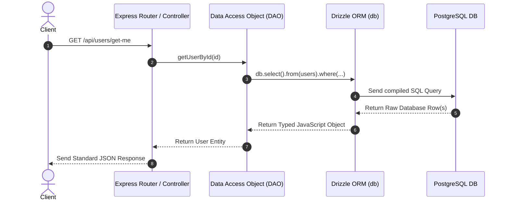
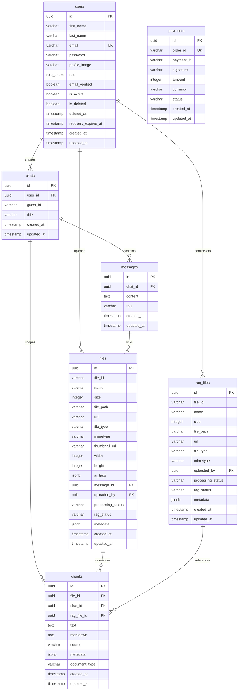

# Apex PostgreSQL Database (pg-db) Architecture & Operations Manual

This document provides a comprehensive blueprint of the PostgreSQL database layer managed via **Drizzle ORM**. It details the architectural flow, directory layout, specific file roles, schema mappings, and step-by-step blueprints for creating, migrating, and managing database entities.

---

## 1. Database Connection & Operation Flow

The database layer utilizes `pg` (Node-Postgres) for connection pooling and **Drizzle ORM** as a type-safe SQL query builder.

### Connection Bootstrap Lifecycle

1. **Environment Initialization:** The schema configuration is loaded and validated at server boot time from [`src/config/env.config.js`](../../server/src/config/env.config.js) which verifies the `DATABASE_URL`.
2. **Pool Creation ([`src/config/database.config.js`](../../server/src/config/database.config.js)):** A connection pool (`pg.Pool`) is established. It detects if the connection string requires SSL (e.g., in production/managed databases) and configures connection parameters accordingly.
3. **Drizzle Initialization:** Drizzle wraps the connection pool (`drizzle(pool)`) to expose type-safe queries.
4. **Boot Check ([`server.js`](../../server/server.js)):** During server start, `connectToDatabase()` is executed, sending a simple `select 1` query to verify database liveness before starting the Express listener.

```text
  ┌────────────────────────────────────────────────────────┐
  │                   Express App Boot                     │
  └──────────────────────────┬─────────────────────────────┘
                             │
                             ▼
  ┌────────────────────────────────────────────────────────┐
  │        Read & Validate envConfig.DATABASE_URL          │
  └──────────────────────────┬─────────────────────────────┘
                             │
                             ▼
  ┌────────────────────────────────────────────────────────┐
  │     Initialize new pg.Pool (with conditional SSL)      │
  └──────────────────────────┬─────────────────────────────┘
                             │
                             ▼
  ┌────────────────────────────────────────────────────────┐
  │             Instantiate drizzle(pool) wrapper          │
  └──────────────────────────┬─────────────────────────────┘
                             │
                             ▼
  ┌────────────────────────────────────────────────────────┐
  │     connectToDatabase() executes pool.query('select 1')│
  └──────────────────────────┬─────────────────────────────┘
                             │
            ┌────────────────┴────────────────┐
            ▼ (Success)                       ▼ (Failure)
  ┌──────────────────┐               ┌──────────────────┐
  │ Start Server     │               │ Log Error & Exit │
  │ Express Listener │               │ process.exit(1)  │
  └──────────────────┘               └──────────────────┘
```

### Request-to-Query Execution Flow

For standard API routes requesting database resources, the execution follows a strict layered pattern:



---

## 2. Directory Structure & File Roles

The database layer configuration and schema management are spread across the following folders:

```text
server/
├── drizzle/                             # Auto-generated SQL migration files & schema snapshots
│   ├── meta/                            # Contains version histories and schema relations journal
│   └── 0000_xxxx.sql                    # Executable SQL files representing schema deltas
│
├── src/
│   ├── config/
│   │   ├── database.config.js           # Initializes pg.Pool, drizzle instance, and liveness checks
│   │   └── env.config.js                # Zod schema enforcing DATABASE_URL validation
│   │
│   ├── db/
│   │   ├── migrate.js                   # Executes migrations from ./drizzle into Postgres
│   │   ├── seed.js                      # Seeds default admin, test users, and module entities
│   │   └── schema/                      # Drizzle Schema Definitions (1 file per domain table)
│   │       ├── chats.schema.js
│   │       ├── chunks.schema.js
│   │       ├── files.schema.js
│   │       ├── messages.schema.js
│   │       ├── payments.schema.js
│   │       ├── rag_files.schema.js
│   │       ├── schema.js                # Aggregator file exporting all schemas for migrations
│   │       └── users.schema.js
│   │
│   └── dao/                             # Data Access Objects (Encapsulated Database Queries)
│       ├── chat.dao.js                  # Chat session creations and metadata updates
│       ├── chunk.dao.js                 # Bulk inserts and lookups of segmented RAG chunks
│       ├── file.dao.js                  # Document uploads tracker
│       ├── message.dao.js               # Dialogue history loaders
│       ├── payment.dao.js               # Razorpay order state updates
│       ├── ragFile.dao.js               # Global administrative references
│       └── user.dao.js                  # Identity queries and soft-delete/recovery transitions
│
└── drizzle.config.js                    # CLI config for Drizzle Kit generation and migrations
```

---

## 3. Database Schema Definitions & Relationships

### Entity-Relationship Diagram (ERD)



### Table Specifications & Constraints

#### 1. `users` Table

- **Schema File:** [`src/db/schema/users.schema.js`](../../server/src/db/schema/users.schema.js)
- **Primary Key:** `id` (UUID, auto-generated using `defaultRandom()`).
- **Indices:**
  - `users_email_idx` on `email`
  - `users_role_idx` on `role`
  - `users_is_deleted_idx` on `is_deleted`
  - `users_deleted_at_idx` on `deleted_at`
  - `users_recovery_expires_at_idx` on `recovery_expires_at`
- **Constraints:** `email` is unique and non-nullable.
- **Enums:** Custom PostgreSQL enum `role_enum` mapping to `['user', 'admin']`.

#### 2. `chats` Table

- **Schema File:** [`src/db/schema/chats.schema.js`](../../server/src/db/schema/chats.schema.js)
- **Primary Key:** `id` (UUID).
- **Foreign Keys:**
  - `user_id` references `users.id` with `onDelete: 'cascade'`.
- **Indices:**
  - `chats_user_id_idx` on `user_id`
  - `chats_guest_id_idx` on `guest_id`

#### 3. `messages` Table

- **Schema File:** [`src/db/schema/messages.schema.js`](../../server/src/db/schema/messages.schema.js)
- **Primary Key:** `id` (UUID).
- **Foreign Keys:**
  - `chat_id` references `chats.id` with `onDelete: 'cascade'`.
- **Indices:**
  - `messages_chat_id_idx` on `chat_id`
- **Fields:** `role` is a standard text field restricted at logical level to `'user' | 'ai'`.

#### 4. `files` Table

- **Schema File:** [`src/db/schema/files.schema.js`](../../server/src/db/schema/files.schema.js)
- **Primary Key:** `id` (UUID).
- **Foreign Keys:**
  - `message_id` references `messages.id` with `onDelete: 'cascade'`.
  - `uploaded_by` references `users.id` with `onDelete: 'set null'`.
- **Indices:**
  - `files_message_id_idx` on `message_id`
  - `files_uploaded_by_idx` on `uploaded_by`
- **Fields:** `processing_status` and `rag_status` default to `'pending'`. `metadata` is a `jsonb` field containing parsed page counts, document titles, semantic tags, and suggested prompts.

#### 5. `rag_files` Table

- **Schema File:** [`src/db/schema/rag_files.schema.js`](../../server/src/db/schema/rag_files.schema.js)
- **Primary Key:** `id` (UUID).
- **Foreign Keys:**
  - `uploaded_by` references `users.id` with `onDelete: 'set null'`.
- **Description:** Holds administrative vectors/documents utilized globally by RAG orchestrators.

#### 6. `chunks` Table

- **Schema File:** [`src/db/schema/chunks.schema.js`](../../server/src/db/schema/chunks.schema.js)
- **Primary Key:** `id` (UUID).
- **Foreign Keys:**
  - `file_id` references `files.id` with `onDelete: 'cascade'`.
  - `chat_id` references `chats.id` with `onDelete: 'cascade'`.
  - `rag_file_id` references `rag_files.id` with `onDelete: 'cascade'`.
- **Indices:**
  - `chunks_file_id_idx` on `file_id`
  - `chunks_chat_id_idx` on `chat_id`
  - `chunks_rag_file_id_idx` on `rag_file_id`
- **Description:** Contains structural segmented markdown blocks, page positions, and text extracted via parser scripts.

#### 7. `payments` Table

- **Schema File:** [`src/db/schema/payments.schema.js`](../../server/src/db/schema/payments.schema.js)
- **Primary Key:** `id` (UUID).
- **Constraints:** `order_id` is unique and non-nullable.
- **Indices:**
  - `payments_order_id_idx` on `order_id`
  - `payments_payment_id_idx` on `payment_id`
- **Description:** Tracks order statuses, signatures, and transaction flows verified via payment gateways.

---

## 4. Developer Blueprint: Creating & Managing Database Tables

Follow this step-by-step workflow to introduce a new table or field to the application database. We will use a hypothetical `posts` table as an extension template.

```text
Step 1: Create schema files inside src/db/schema/
Step 2: Import & export new schema in src/db/schema/schema.js
Step 3: Run 'npx drizzle-kit generate' to create migration SQL
Step 4: Run 'npx drizzle-kit migrate' to apply SQL to PostgreSQL
Step 5: Write a DAO inside src/dao/ to encapsulate raw query queries
Step 6: Update src/db/seed.js to insert initial test dataset
```

### Step 1: Write the Schema File

Create a new file inside `src/db/schema/` (e.g., `src/db/schema/posts.schema.js`). Use type-safe declarations from `drizzle-orm/pg-core`:

```javascript
// File: src/db/schema/posts.schema.js
import { pgTable, uuid, text, timestamp, index } from "drizzle-orm/pg-core";
import { users } from "./users.schema.js";

export const posts = pgTable(
  "posts",
  {
    id: uuid("id").defaultRandom().primaryKey(),
    userId: uuid("user_id")
      .references(() => users.id, { onDelete: "cascade" })
      .notNull(),
    title: text("title").notNull(),
    content: text("content").notNull(),
    createdAt: timestamp("created_at", { withTimezone: true })
      .defaultNow()
      .notNull(),
    updatedAt: timestamp("updated_at", { withTimezone: true })
      .defaultNow()
      .notNull(),
  },
  (table) => {
    return {
      userIdIdx: index("posts_user_id_idx").on(table.userId),
    };
  },
);
```

### Step 2: Register the Schema in the Aggregator

Open [`src/db/schema/schema.js`](../../server/src/db/schema/schema.js) and import/export the newly created schema table:

```javascript
// File: src/db/schema/schema.js
import { users } from "./users.schema.js";
import { payments } from "./payments.schema.js";
import { chats } from "./chats.schema.js";
import { messages } from "./messages.schema.js";
import { files } from "./files.schema.js";
import { chunks } from "./chunks.schema.js";
import { ragFiles } from "./rag_files.schema.js";
import { posts } from "./posts.schema.js"; // <-- Import new schema

export { users, payments, chats, messages, files, chunks, ragFiles, posts }; // <-- Export new schema
```

### Step 3: Generate SQL Migrations

Run the Drizzle-Kit generator in the root of the `server/` directory:

```bash
npx drizzle-kit generate
```

This inspects the differences between `src/db/schema/schema.js` and the snapshot files within `./drizzle`, generating an executable migration script `drizzle/000X_xxxx.sql`.

### Step 4: Apply Migrations to the Database

To apply the changes immediately on your local/development database run:

```bash
npx drizzle-kit migrate
```

Alternatively, Drizzle migrations can be run using the preconfigured server migration script:

```bash
node src/db/migrate.js
```

### Step 5: Write the Data Access Object (DAO)

Create a new file in `src/dao/` (e.g., `src/dao/post.dao.js`) to encapsulate all database reads, writes, and updates. **Do not execute raw database queries inside controllers; always route them through DAOs.**

```javascript
// File: src/dao/post.dao.js
import { db } from "../config/database.config.js";
import { posts } from "../db/schema/posts.schema.js";
import { eq, and } from "drizzle-orm";

/**
 * Inserts a new post record
 * @param {object} postData - { userId, title, content }
 * @returns {Promise<object>} New post record
 */
export async function createPost(postData) {
  const [newPost] = await db.insert(posts).values(postData).returning();
  return newPost;
}

/**
 * Fetches all posts belonging to a specific user
 * @param {string} userId
 * @returns {Promise<Array>} List of post records
 */
export async function getPostsByUserId(userId) {
  return await db.select().from(posts).where(eq(posts.userId, userId));
}

/**
 * Updates an existing post
 * @param {string} id - Post UUID
 * @param {object} updates - Fields to modify
 * @returns {Promise<object|null>} Updated record or null
 */
export async function updatePost(id, updates) {
  const [updatedPost] = await db
    .update(posts)
    .set({ ...updates, updatedAt: new Date() })
    .where(eq(posts.id, id))
    .returning();
  return updatedPost || null;
}
```

### Step 6: Update Seed Scripts

If the table requires initial bootstrap data (e.g., lookup values or default items), edit the database seed file [`src/db/seed.js`](../../server/src/db/seed.js):

```javascript
// File: src/db/seed.js
import { posts } from "./schema/posts.schema.js";
// ... other imports

async function seedPosts(insertedUsers) {
  if (!insertedUsers || insertedUsers.length === 0) return;

  const dummyPosts = [
    {
      userId: insertedUsers[0].id,
      title: "Welcome to Apex",
      content: "This is the initial system post content.",
    },
  ];

  try {
    await db.insert(posts).values(dummyPosts);
    console.log("Seeded posts table successfully");
  } catch (error) {
    console.error("Error seeding posts:", error);
  }
}
```

Expose `seedPosts` in the `main` run pipeline of the seeder and run:

```bash
node src/db/seed.js
```
