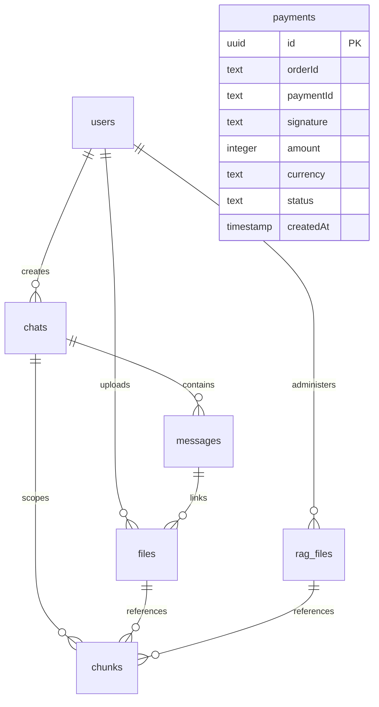
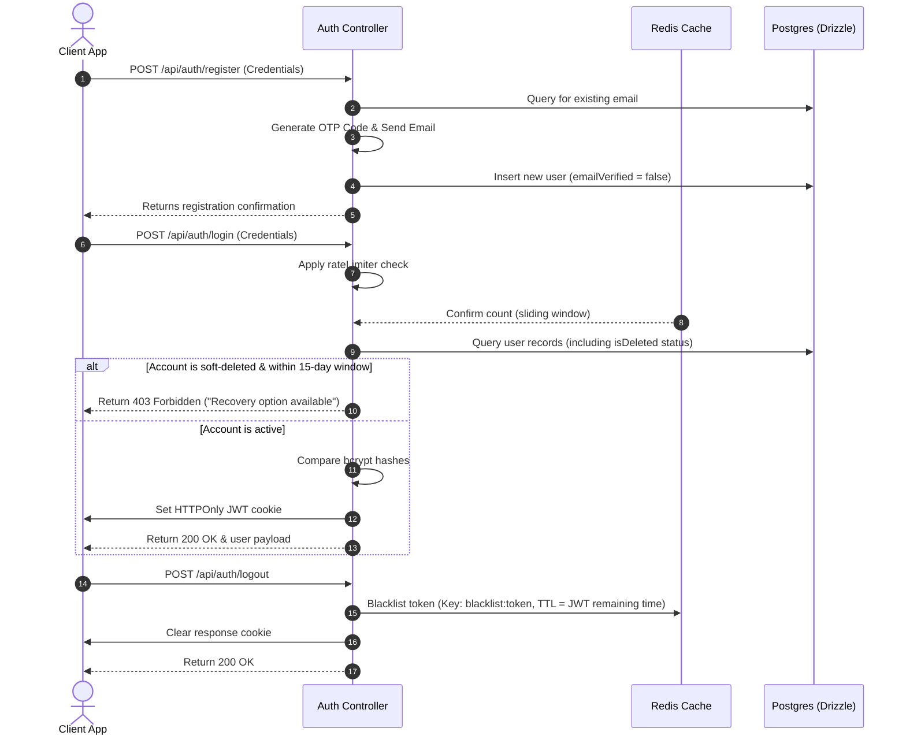
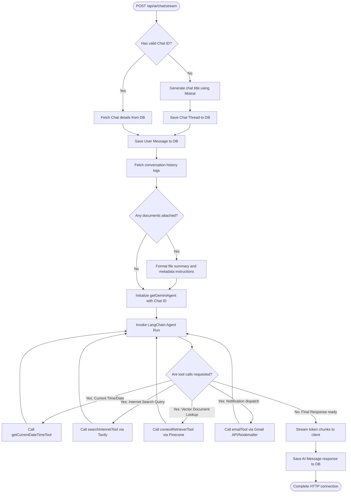
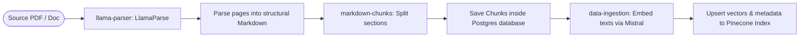
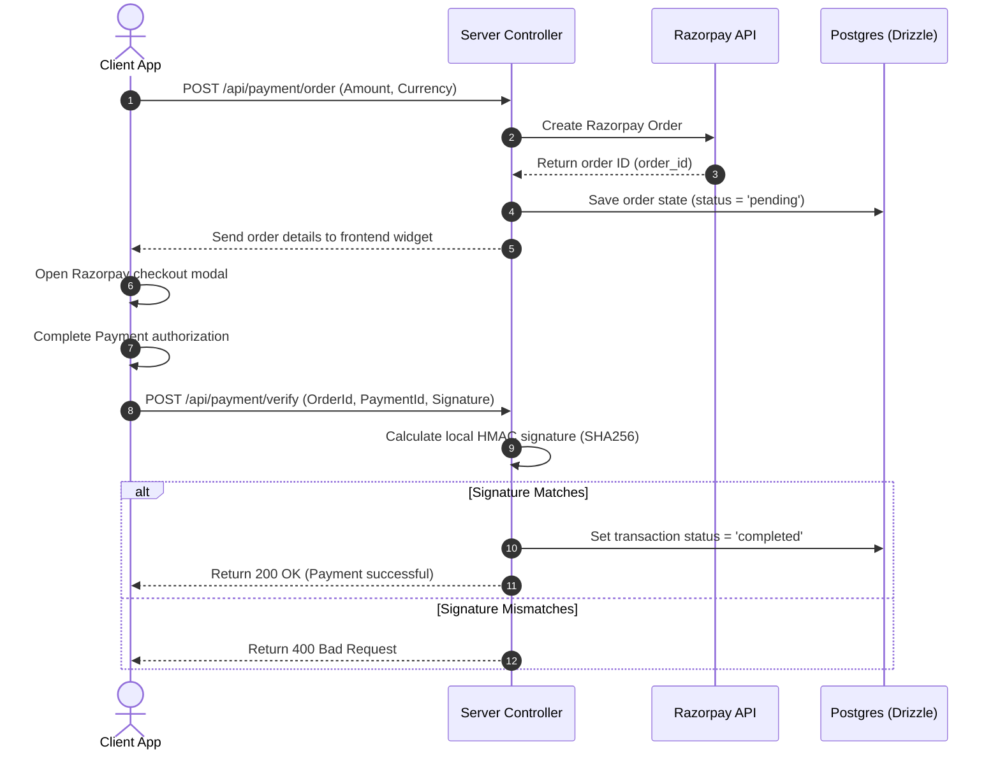
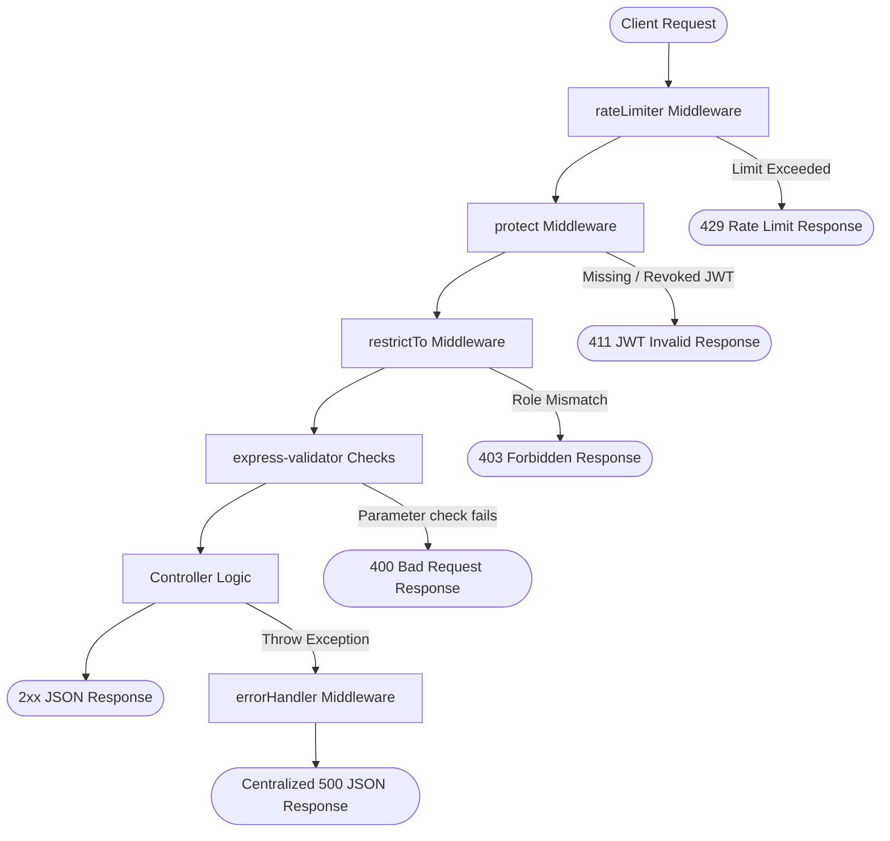

# Apex Backend Server Architecture & Operations Guide

Welcome to the **Apex Backend Server Architecture & Operations Guide**. This document provides an in-depth reference for the server-side system design, folder structure, database schema, and operational execution flows.

It is designed to act as a production-ready blueprint and blueprint-extension guide. Future modules, databases, or API flows should be developed in accordance with the patterns established below.

---

## 1. System Overview & Technology Stack

The Apex backend is built as a production-grade, modular Node.js application using Express and modern ES Modules (`import`/`export`). It manages core operations for user management, authentication, payment processing, RAG (Retrieval-Augmented Generation), streaming conversational AI agents, and high-speed HTML-to-PDF document generation.

### Core Technologies

- **Web Framework:** [Express.js](https://expressjs.com/) (using custom asynchronous routers and centralized error-handling middlewares).
- **Database & Query Layer:** PostgreSQL orchestrated via [Drizzle ORM](https://orm.drizzle.team/) with typed schemas, database pool connections (`pg.Pool`), and raw Data Access Objects (DAOs).
- **Caching & Rate Limiting:** Redis via the `ioredis` driver, managing JWT session blacklists and sliding-window rate limit states.
- **AI Orchestration:** [LangChain](https://js.langchain.com/) with native bindings for **Google Gemini** (`gemma-2-27b-it` / `gemini-3.5-flash` / `gemini-3.1-flash-lite`) and **Mistral AI** (`mistral-embed` for vector embeddings).
- **Vector Search DB:** [Pinecone DB](https://www.pinecone.io/) for document indexing and metadata-scoped chunk lookups.
- **Document Parsing:** [LlamaIndex Cloud Parser](https://cloud.llamaindex.ai/) (LlamaParse) for converting rich format files (PDFs, spreadsheets) into structured semantic markdown.
- **External Integrations:**
  - **Razorpay:** Transaction management, signature checking, and refunds.
  - **ImageKit:** CDN and asset storage hosting for user avatars and processed RAG files.
  - **Gmail API & Nodemailer:** Email verification, recovery OTPs, and system notification deliveries.
- **HTML-to-PDF Engine:** `html-pdf-lite` (powered by PDFKit and `@resvg/resvg-js` rasterizers) producing Chromium-free, rapid-rendering, and lightweight PDFs.

---

## 2. Directory Layout & Folder Descriptions

The server codebase adopts a modular, domain-centric directory structure to keep services, database logic, and endpoints clean, decoupled, and easy to scale.

```text
server/
├── drizzle/                         # Auto-generated SQL migration files and schema snapshots
├── src/
│   ├── app.js                       # Express app configuration, middleware pipeline, and root api routes
│   │
│   ├── config/                      # Environment variables, database connection pools, cache clients
│   │   ├── cache.config.js          # Redis connection instance via ioredis
│   │   ├── database.config.js       # PostgreSQL pg.Pool configuration and Drizzle initialization
│   │   └── env.config.js            # Environment variable validation schema (powered by Zod)
│   │
│   ├── cron/                        # Scheduled cron jobs running in background
│   │   └── cleanup.cron.js          # Cleans up expired soft-deleted users (runs nightly)
│   │
│   ├── dao/                         # Data Access Objects (encapsulates Drizzle database queries)
│   │   ├── chat.dao.js              # CRUD operations on chat conversations
│   │   ├── chunk.dao.js             # Bulk inserts and lookups of segmented RAG chunks
│   │   ├── file.dao.js              # Database management for user message attachments
│   │   ├── message.dao.js           # CRUD for conversational history logs
│   │   ├── payment.dao.js           # Read/write for Razorpay transaction orders
│   │   ├── ragFile.dao.js           # Operations for administrative RAG documents
│   │   └── user.dao.js              # User profiles, verification state, soft-delete recovery
│   │
│   ├── db/                          # Database connection setup and ORM models
│   │   ├── migrate.js               # Database migration execution script
│   │   ├── seed.js                  # Database seeder for default values
│   │   └── schema/                  # PostgreSQL Drizzle table schema declarations
│   │       ├── chats.schema.js
│   │       ├── chunks.schema.js
│   │       ├── files.schema.js
│   │       ├── messages.schema.js
│   │       ├── payments.schema.js
│   │       ├── rag_files.schema.js
│   │       ├── schema.js            # Aggregator importing all schemas for migrations
│   │       └── users.schema.js
│   │
│   ├── modules/                     # Business domain logic (routers, controllers, validations)
│   │   ├── auth/                    # Auth lifecycle, user profile updates, and admin APIs
│   │   │   ├── controllers/         # Handles login, registration, recovery, and user profiles
│   │   │   ├── middleware/          # protect, restrictTo RBAC, and rateLimiter middlewares
│   │   │   ├── routes/              # Express routers: auth.routes.js, user.routes.js, admin.routes.js
│   │   │   ├── services/            # Cleanup cron service wrapper
│   │   │   ├── tests/               # Unit tests for authentication
│   │   │   ├── utils/               # Auth token encoders/decoders
│   │   │   └── validators/          # request body checks via express-validator
│   │   │
│   │   ├── ai/                      # Conversational AI streams
│   │   │   ├── controllers/         # Handles streamed responses and title creators
│   │   │   └── routes/              # Routes for streaming chat threads
│   │   │
│   │   ├── pdf/                     # PDF routes and render interfaces
│   │   │   ├── controllers/         # Invoice, receipt and raw HTML PDF render endpoints
│   │   │   └── routes/              # Endpoints for generating, streaming and previewing PDFs
│   │   │
│   │   └── rag/                     # RAG admin interfaces
│   │       ├── controllers/         # Upload files to vector indices and clean tables
│   │       └── routes/              # Endpoints for admin bulk indexers
│   │
│   ├── rag/                         # Core RAG ingest pipelines
│   │   ├── context-retrieval.rag.js # Search queries inside Pinecone and retrieves relative metadata
│   │   ├── data-ingestion.rag.js    # Embeds chunks using Mistral and loads them to Pinecone
│   │   ├── llama-parser.rag.js      # Integrates LlamaCloud parser for HTML/text conversions
│   │   └── markdown-chunks.rag.js   # Parses markdown files and segments them into overlapping sections
│   │
│   ├── services/                    # Adapter wrappers for external SaaS and cloud resources
│   │   ├── ai/                      # Gemini configurations, failover routing, and agent tooling
│   │   ├── mail/                    # Email dispatch systems (SMTP NodeMailer / Gmail API)
│   │   ├── image.service.js         # ImageKit bucket upload helpers
│   │   ├── internet.service.js      # Tavily search query client
│   │   ├── payment.service.js       # Razorpay orders and webhook signature validations
│   │   ├── pdf/                     # makePDF library wrapper, margins config, and error handlers
│   │   └── pinecone.service.js      # Pinecone client initializer
│   │
│   ├── templates/                   # Synchronous HTML code generation engines for documents
│   │   ├── utils/                   # HTML sanitizer and formatting utilities
│   │   ├── index.js                 # Export entry point for templates
│   │   └── pdf.template.js          # Invoice and receipt layout definitions
│   │
│   ├── tests/                       # Automated unit and visual verification tests
│   │   ├── pdf/                     # PDF rendering and CSS compatibility check suites
│   │   └── templates/               # Testing suite for HTML templates outputs
│   │
│   ├── utils/                       # Shared server-wide helper utilities
│   │   ├── otp.utils.js             # OTP tokens and email markup generations
│   │   ├── password.utils.js        # Cryptographically secure temporary password generation
│   │   └── response.utlis.js        # Standardized HTTP and PDF stream JSON templates
│   │
│   └── validators/                  # Common express-validator utility checks
│
└── package.json                     # Node script commands and package definitions
└── server.js                    # Core server entry point (initializes db pool and starts Express listener)
```

---

## 3. Database Schema

All entity tables are managed inside [src/db/schema](../../server/src/db/schema) using Drizzle ORM syntax. Relationships, cascading deletions, indexes, and primary/foreign key attributes are fully typed.

### Schema ER Diagram



### Table Definitions & Structure

1. **`users` (`users.schema.js`):**
   - **Fields:** `id` (UUID PK), `firstName`, `lastName`, `email` (Unique Index), `password` (bcrypt), `profileImage`, `role` (Enum: `user`, `admin`), `emailVerified` (Boolean), `isActive` (Boolean), `isDeleted` (Boolean), `deletedAt`, `recoveryExpiresAt`.
   - **Purpose:** Manages identity records, verification states, roles, and soft-delete recovery bounds.

2. **`chats` (`chats.schema.js`):**
   - **Fields:** `id` (UUID PK), `userId` (FK references `users.id` with cascade deletion), `guestId` (Index for guest support), `title` (Default: `'New chat'`), timestamps.
   - **Purpose:** Represents a unique chat thread/session.

3. **`messages` (`messages.schema.js`):**
   - **Fields:** `id` (UUID PK), `chatId` (FK references `chats.id` with cascade deletion), `content` (Text), `role` (Enum: `user`, `ai`), timestamps.
   - **Purpose:** Stores the dialogue logs for user inputs and AI generator responses.

4. **`files` (`files.schema.js`):**
   - **Fields:** `id` (UUID PK), `fileId` (ImageKit reference), `name`, `size`, `filePath`, `url`, `fileType`, `mimetype`, `messageId` (FK references `messages.id` with cascade deletion), `uploadedBy` (FK references `users.id`), `processingStatus` (Enum: `pending`, `completed`, `failed`), `ragStatus`, `metadata` (JSONB for structural summary/sections), timestamps.
   - **Purpose:** Metadata records for user-uploaded documents/images scoped to specific messages and chats.

5. **`rag_files` (`rag_files.schema.js`):**
   - **Fields:** `id` (UUID PK), `fileId`, `name`, `size`, `filePath`, `url`, `fileType`, `mimetype`, `uploadedBy` (FK references `users.id`), `processingStatus`, `ragStatus`, `metadata` (JSONB), timestamps.
   - **Purpose:** Administrative global reference documents uploaded by admins to provide domain context to conversational queries.

6. **`chunks` (`chunks.schema.js`):**
   - **Fields:** `id` (UUID PK), `fileId` (FK references `files.id`), `chatId` (FK references `chats.id`), `ragFileId` (FK references `rag_files.id`), `text`, `markdown`, `source`, `metadata` (JSONB: pages, headers), `documentType`, timestamps.
   - **Purpose:** Segments extracted from parsed documents. Used to retrieve text elements before calling LLMs.

7. **`payments` (`payments.schema.js`):**
   - **Fields:** `id` (UUID PK), `orderId` (Unique Index), `paymentId` (Index), `signature`, `amount` (Integer in smallest currency units, e.g., cents/paise), `currency`, `status` (Enum: `pending`, `completed`, `refunded`, `partially_refunded`), timestamps.
   - **Purpose:** Tracks transaction lifecycles verified via Razorpay APIs.

---

## 4. Key Operation Flows

### A. Authentication, Rate Limiting & User Lifecycle

Authentication is built with JWT cookies/headers, custom verification steps, sliding window rate limits, soft-deletion recovery buffers, and background garbage-collection processes.



#### Sliding Window Rate Limiting Detail

The rate-limiting middleware uses a sliding-window tracker powered by Redis commands:

- Computes Redis keys: `ratelimit:{IP_Address}:{Request_URL}`.
- Uses `INCR` to track rate hits and `PEXPIRE` to auto-expire tracker keys.
- Requests exceeding configured parameters trigger a `429 Too Many Requests` response.

#### Account Recovery & Clean Up

- **Soft Deletion (`DELETE /api/users/me`):** Calls `softDeleteUser()` to toggle `isDeleted = true`, `isActive = false`, and sets `recoveryExpiresAt = NOW + 15 days`.
- **Recovery Request:** Logging in during this 15-day recovery window is blocked, but provides access to the `/recover-account/request` route. This route generates an OTP code and dispatches a verification email.
- **Verification (`POST /recover-account/verify`):** If the OTP verification matches, `recoverUser()` restores user flags (`isDeleted = false, isActive = true`) and nullifies recovery timestamps.
- **Background Cleanup Cron (`cleanup.cron.js`):** Instantiates a `node-cron` schedule executing at midnight IST daily. It runs `cleanupExpiredDeletedUsers()` to permanently remove users whose `recoveryExpiresAt` date is in the past.

---

### B. AI Chat Streaming & Tool-Calling Agents

Conversations inside `/api/ai/chat/stream` support real-time token streaming and dynamic multi-agent tool execution via LangChain.



#### Model Configurations & Failover Routing

1. **Title Generation:** Conducted in the background using a Mistral model helper [generateChatTitle](../../server/src/services/ai/response.ai.service.js) restricting output to plain strings.
2. **Primary Chat Agent:** Instantiated inside `getGeminiAgent` using the high-performance model (`gemma-4-31b-it` or custom Google LLM).
3. **Resilience Routing:** If the primary LLM fails due to rate limits or API outages, `streamAiResponse` catches the exception and routes the query to `getGeminiFallbackAgent` (powered by `gemini-3.1-flash-lite`) to guarantee uninterrupted chat availability.

---

### C. RAG Ingestion & Vector Retrieval Pipeline

Document processing converts unstructured documents into searchable vectors scoped to the user's active session.



1. **Document Parsing (`llama-parser.rag.js`):** Submits document streams/URLs to LlamaCloud API with parameters to parse embedded tables, graphics, and mathematical formats.
2. **Segmentation & Hierarchy parsing (`markdown-chunks.rag.js`):**
   - Tracks document bounds using standard page markers (`<!-- PAGE:n -->`).
   - Applies LangChain's `RecursiveCharacterTextSplitter` configured with a target `chunkSize` of `700` and `chunkOverlap` of `120`.
   - Parses the document's header hierarchy (`h1`, `h2`, `h3`) to map sections, starting pages, and ending pages to each chunk object's metadata.
3. **Database Chunks Cache:** Inserts chunk records into the PostgreSQL database (`chunks` table) using `createChunksBulk()`.
4. **Vector Embeddings (`data-ingestion.rag.js`):**
   - Requests embeddings for chunk texts via Mistral AI embeddings API (`mistral-embed` model).
   - Generates and writes Pinecone vectors matching the chunk ID, appending reference metadata: `{ file: fileId, chat: chatId, ragFile: ragFileId }`.
5. **Session-Scoped Retrieval (`context-retrieval.rag.js`):**
   - The agent invokes the `contextRetrieverTool` during a chat.
   - The query query string is embedded via the Mistral AI embedding model.
   - Pinecone index is searched for matching vectors. The query uses metadata filters (`chat: { $eq: chatId }`) to isolate query boundaries to the current chat session, preventing cross-chat document leakages.

---

### D. Razorpay Payment Orchestration

Transactions are tracked with order states and signature verification loops.



- **Verification Formula:**
  $$\text{Expected Signature} = \text{HMAC-SHA256}(\text{orderId} + \text{"|"} + \text{paymentId}, \text{RAZORPAY\_KEY\_SECRET})$$
- **Refunds Flow:** Triggering `refundPayment()` calls the Razorpay Refund endpoint. Upon successful completion, the local status is updated to `'refunded'` (or `'partially_refunded'`).

---

### E. Chromium-Free PDF Generation Flow

The PDF generator (`makePDF`) converts HTML to PDF without headless browser overhead.

```text
┌────────────────────┐
│  Data Object Input │ (Invoice items, metadata, receipt info)
└─────────┬──────────┘
          │
          ▼
┌────────────────────┐
│ Template Function  │ (Pure JS function combining data with escapeHtml)
└─────────┬──────────┘
          │
          ▼
┌────────────────────┐
│     makePDF()      │ (Validates input and applies margins)
└─────────┬──────────┘
          │
          ▼
┌────────────────────┐
│   html-pdf-lite    │ (PDFKit engine parsing HTML and SVG elements)
└─────────┬──────────┘
          │
          ▼
┌────────────────────┐
│    Buffer Output   │ (Node.js Buffer returned to Express / mailers / storage)
└────────────────────┘
```

- **Guidelines:**
  1. **User input sanitization:** Always wrap variables in `escapeHtml()`.
  2. **Self-contained assets:** Vector paths (SVGs) or base64 data-URIs must be inline.
  3. **Scripts:** JavaScript scripts inside templates are disabled (`allowScripts: false`) for security.
  4. **Client Download Helper (`client/src/utils/pdfDownload.js`):** Fetches the file stream using credentials, parses the `Content-Disposition` header to extract the filename, and triggers a download link in the browser DOM.

---

## 5. Global Middleware & Error Handling Pipeline

Every API request passes through a global middleware pipeline to validate headers, authenticate sessions, verify roles, and catch exceptions.



1. **`rateLimiter` (`auth.middleware.js`):** Prevents brute force and API spam using Redis sliding-window tracking.
2. **`protect` (`auth.middleware.js`):** Checks the request cookie `token` or authorization bearer token. Verifies the token against the secret key and matches it against the Redis blacklist (`blacklist:${token}`) before adding the user payload to `req.user`.
3. **`restrictTo` (`auth.middleware.js`):** Restricts access to authorized roles (e.g., `['admin']`).
4. **`express-validator` Checks:** Custom request body parameter assertions before executing target route controllers.
5. **`errorHandler` (`errorHandler.js`):** A centralized `(err, req, res, next)` Express middleware that logs errors and returns standard JSON error objects, preventing stack trace leaks.

---

## 6. Developer Guidelines & Extension Templates

Follow these blueprints to extend the application with new features:

### A. How to Add a New Database Schema & Run Migrations

1. Create a new schema file in `src/db/schema/` (e.g., `src/db/schema/posts.schema.js`):
   ```js
   import { pgTable, uuid, text, timestamp } from "drizzle-orm/pg-core";
   import { users } from "./users.schema.js";

   export const posts = pgTable("posts", {
     id: uuid("id").defaultRandom().primaryKey(),
     userId: uuid("user_id")
       .references(() => users.id, { onDelete: "cascade" })
       .notNull(),
     title: text("title").notNull(),
     content: text("content").notNull(),
     createdAt: timestamp("created_at", { withTimezone: true })
       .defaultNow()
       .notNull(),
     updatedAt: timestamp("updated_at", { withTimezone: true })
       .defaultNow()
       .notNull(),
   });
   ```
2. Register the schema in `src/db/schema/schema.js` to expose it to the ORM generator:
   ```js
   export * from "./users.schema.js";
   export * from "./posts.schema.js";
   // Import and export other schemas here
   ```
3. Generate and apply migrations using the following commands inside the `server/` directory:
   ```bash
   # Generate migration SQL
   npx drizzle-kit generate

   # Apply migration to database
   npx drizzle-kit migrate
   ```

### B. How to Create a Data Access Object (DAO)

Encapsulate Drizzle database logic in the `src/dao/` directory (e.g., `src/dao/post.dao.js`):

```js
import { db } from "../config/database.config.js";
import { posts } from "../db/schema/posts.schema.js";
import { eq } from "drizzle-orm";

export async function createPost(postData) {
  const [newPost] = await db.insert(posts).values(postData).returning();
  return newPost;
}

export async function getPostsByUserId(userId) {
  return await db.select().from(posts).where(eq(posts.userId, userId));
}
```

### C. How to Add a Modular Business Feature (Module)

1. Create a new domain folder inside `src/modules/` (e.g., `src/modules/post/`).
2. Add your controller (`src/modules/post/controllers/post.controller.js`):
   ```js
   import { createPost } from "../../../dao/post.dao.js";
   import { sendResponse } from "../../../utils/response.utlis.js";

   export async function handleCreatePost(req, res, next) {
     try {
       const { title, content } = req.body;
       const newPost = await createPost({
         userId: req.user.id,
         title,
         content,
       });
       return sendResponse({
         res,
         statusCode: 201,
         success: true,
         message: "Post created successfully",
         data: newPost,
       });
     } catch (error) {
       return next(error);
     }
   }
   ```
3. Add routes (`src/modules/post/routes/post.routes.js`):
   ```js
   import { Router } from "express";
   import { handleCreatePost } from "../controllers/post.controller.js";
   import { protect } from "../../auth/index.js";

   const postRouter = Router();
   postRouter.post("/", protect, handleCreatePost);

   export default postRouter;
   ```
4. Expose the router in `src/app.js`:
   ```js
   import postRouter from "./modules/post/routes/post.routes.js";
   // ...
   app.use("/api/posts", postRouter);
   ```

### D. How to Add a Background Cron Job

1. Create a task scheduler script or edit `src/cron/cleanup.cron.js`.
2. To create a new cron task, create a file in `src/cron/` (e.g., `src/cron/analytics.cron.js`):
   ```js
   import cron from "node-cron";

   cron.schedule(
     "0 0 * * *",
     async () => {
       try {
         console.log("[Cron] Fetching daily statistics...");
         // Run operations here
       } catch (error) {
         console.error("[Cron] Analytics calculation error:", error);
       }
     },
     {
       timezone: "Asia/Kolkata",
     },
   );
   ```
3. Import the cron file inside `server.js` to start the scheduler at server boot time:
   ```js
   import "./src/cron/analytics.cron.js";
   ```

### E. How to Create a New HTML PDF Template

1. Write a pure template function inside `src/templates/` (e.g., `src/templates/report.template.js`):
   ```js
   import { escapeHtml } from "./utils/escapeHtml.js";

   export function reportTemplate(data = {}) {
     return `<!DOCTYPE html>
       <html lang="en">
       <head>
           <meta charset="UTF-8">
           <title>${escapeHtml(data.title || "Summary Report")}</title>
           <style>
               body { font-family: sans-serif; padding: 20px; color: #333; }
               h1 { color: #2563eb; }
           </style>
       </head>
       <body>
           <h1>${escapeHtml(data.title)}</h1>
           <p>${escapeHtml(data.body)}</p>
       </body>
       </html>`;
   }
   ```
2. Export your template inside `src/templates/index.js`.
3. Render using `makePDF` inside your controller:
   ```js
   import { makePDF } from "../../../services/pdf/index.pdf.service.js";
   import { reportTemplate } from "../../../templates/index.js";

   const html = reportTemplate({
     title: "System Audit",
     body: "Security review complete.",
   });
   const pdfBuffer = await makePDF({ html });
   ```

### F. How to Dispatch System Emails (Mail Service)

The server integrates a dual-mode dispatch mechanism inside [`src/services/mail/mail.service.js`](../../server/src/services/mail/mail.service.js):

- **Development Mode:** Dispatches via Nodemailer with local SMTP settings.
- **Production Mode:** Dispatches via Google Gmail APIs.

#### Usage Example:

```js
import { sendEmail } from "../../services/mail/mail.service.js";

await sendEmail({
  to: "user@example.com",
  subject: "System Alert",
  html: "<h1>Security Update Required</h1><p>Your password is set to expire soon.</p>",
  text: "Security Update Required. Your password is set to expire soon.",
});
```

---

### G. How to Issue and Verify OTP Codes (OTP Utils)

The system manages secure OTP verification workflows backed by Redis using [`src/utils/otp.utils.js`](../../server/src/utils/otp.utils.js).

#### 1. Issuing an OTP (Saves to Redis and Emails User)

```js
import {
  issueOtp,
  OTP_PURPOSES,
  getOtpHtml,
} from "../../../utils/otp.utils.js";

const result = await issueOtp({
  email: "user@example.com",
  purpose: OTP_PURPOSES.VERIFY_EMAIL,
  subject: "Verification Code",
  buildHtml: getOtpHtml, // Pure template function that outputs HTML markup
});

if (result.ok) {
  console.log("OTP issued successfully. Dev Code:", result.otp);
}
```

#### 2. Verifying a Received OTP

```js
import { verifyOtp, OTP_PURPOSES } from "../../../utils/otp.utils.js";

const validation = await verifyOtp({
  email: "user@example.com",
  code: "123456",
  purpose: OTP_PURPOSES.VERIFY_EMAIL,
});

if (validation.ok) {
  console.log("OTP verified successfully!");
} else {
  console.log("Verification failed due to:", validation.reason); // e.g. 'expired', 'mismatch', 'too-many-attempts'
}
```

---

### H. How to Return Standardized API Responses (Response Utils)

Controllers should always return standard responses using [`src/utils/response.utlis.js`](../../server/src/utils/response.utlis.js) to ensure consistent payloads across the entire client-server boundary.

#### 1. Standard JSON Data Response

```js
import { sendResponse } from "../../../utils/response.utlis.js";

return sendResponse({
  res,
  statusCode: 200,
  success: true,
  message: "Data retrieved successfully",
  data: { items: [1, 2, 3] },
});
```

#### 2. Auth Cookie & JWT Token Response

```js
import { sendTokenResponse } from "../../../utils/response.utlis.js";

// Signs JWT token, places HTTPOnly cookie, and returns sanitized user payload
return sendTokenResponse(res, 200, "Login successful", userRecord, true); // true sets rememberMe (15-day expiry)
```

#### 3. Streaming PDF Buffer Response

```js
import { sendPdfResponse } from "../../../utils/response.utlis.js";

// Attaches correct application/pdf contentType headers and file download headers
return sendPdfResponse({
  res,
  pdfBuffer: pdfBinaryData,
  filename: "invoice-2026.pdf",
  isInline: true, // Sets Content-Disposition header to inline (previews in browser instead of downloading)
});
```

---

### I. How to Upload Assets to ImageKit (Image Service)

Image, PDF, or document uploads are handled using [`src/services/image.service.js`](../../server/src/services/image.service.js) backed by the ImageKit Node.js SDK.

#### 1. Uploading a Single Image (e.g. Profile Avatar)

```js
import { uploadImageOnImageKit } from "../../../services/image.service.js";

// Expects standard multer file object from req.file
const uploadResult = await uploadImageOnImageKit({ image: req.file });
console.log("Uploaded File URL:", uploadResult.url);
```

#### 2. Uploading Bulk Files to Custom Category Folders

```js
import { uploadMultipleImagesOnImageKit } from "../../../services/image.service.js";

// Automatically places uploads into hackathon/images, hackathon/pdfs, or hackathon/others based on mimetype
const filesArray = await uploadMultipleImagesOnImageKit(req.files);
console.log(
  "Bulk uploads list:",
  filesArray.map((f) => f.url),
);
```

---

### J. How to Leverage Redis Caching (Cache Client)

Use the ioredis instance inside [`src/config/cache.config.js`](../../server/src/config/cache.config.js) to store custom cache values, manage session blacklist tokens, or track rate limits.

#### Usage Example:

```js
import redis from "../../../config/cache.config.js";

// Setting keys with expiration time (EX) in seconds
await redis.set("custom_key:123", JSON.stringify({ active: true }), "EX", 3600);

// Fetching cached value
const rawData = await redis.get("custom_key:123");
if (rawData) {
  const cachedData = JSON.parse(rawData);
  console.log(cachedData.active);
}

// Deleting keys
await redis.del("custom_key:123");
```

---

### K. How to Trigger Vector Ingestion and Search (RAG Pipeline)

For uploading user files or referencing admin documents within the RAG agent vector search scope, use the ingestion wrappers:

#### 1. Ingestion Pipeline upload (ImageKit + Database Chunks + Pinecone Vector Upserts)

```js
import { dataIngestion } from "../../../rag/data-ingestion.rag.js";

// Ingestion starts in background and updates file.ragStatus to 'completed' / 'failed'
dataIngestion({
  fileUrl: fileRecord.url,
  file: fileRecord.id, // The UUID of the files/ragFiles table row
  chat: chatId, // Scopes vector lookup boundary. Pass null for admin/global documents
  documentType: fileRecord.mimetype,
  source: fileRecord.name,
  isGlobal: false, // Set to true for admin-uploaded reference documents
}).catch((err) => {
  console.error("Vector ingestion failed:", err);
});
```

#### 2. Retrieve Relevant Context Chunks from Pinecone

```js
import { getContextChunks } from "../../../rag/context-retrieval.rag.js";

// Searches Pinecone for matching vectors. Scopes searches specifically to the active chatId
const relevantContext = await getContextChunks({
  query: "What are the core billing policies?",
  chatId: activeChatId,
  topK: 5, // Returns top 5 relevant semantic segments
});

console.log("Ingested matching segments:", relevantContext);
```

---

### L. How to Generate Secure Temporary Passwords (Password Utils)

The system provides a utility to generate cryptographically secure temporary passwords (e.g., for recovery, onboarding, or automated provisioning) using [`src/utils/password.utils.js`](../../server/src/utils/password.utils.js).

#### 1. Generating a Secure Temporary Password

```js
import { generateTempPassword } from "../../../utils/password.utils.js";

// Generates an 8-character (default) secure temporary password
const tempPassword = generateTempPassword(); // e.g. "aB3!dE9#"

// Or specify a custom length (minimum 6 characters)
const customTempPassword = generateTempPassword(12);
```
